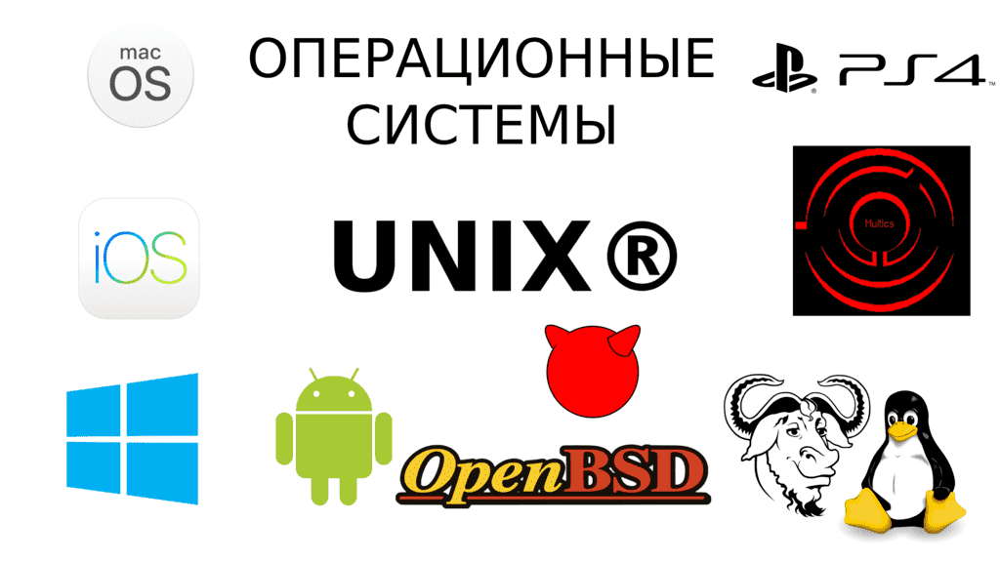
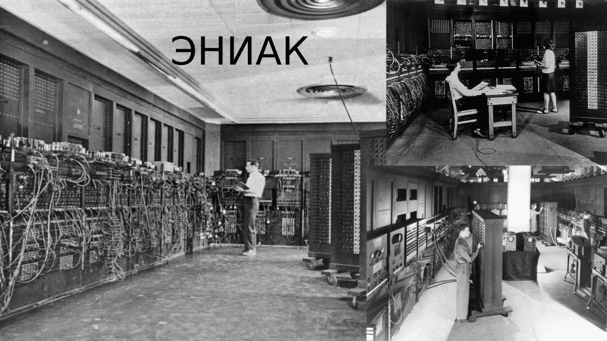
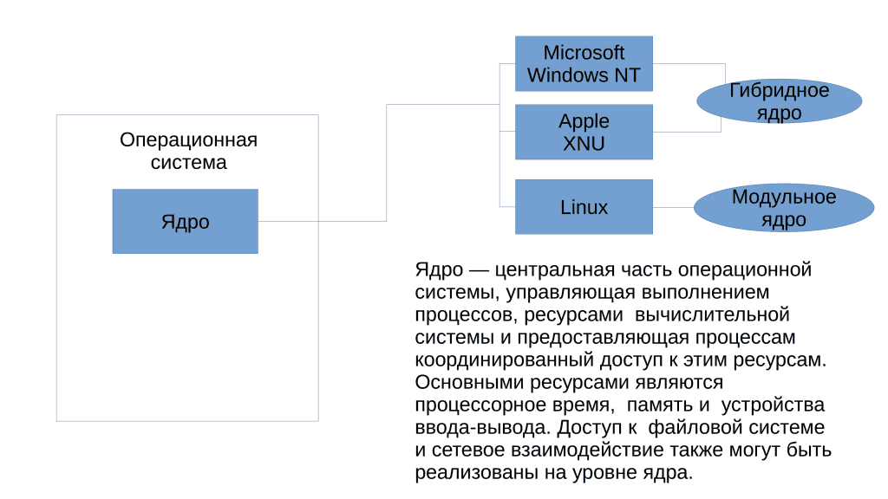
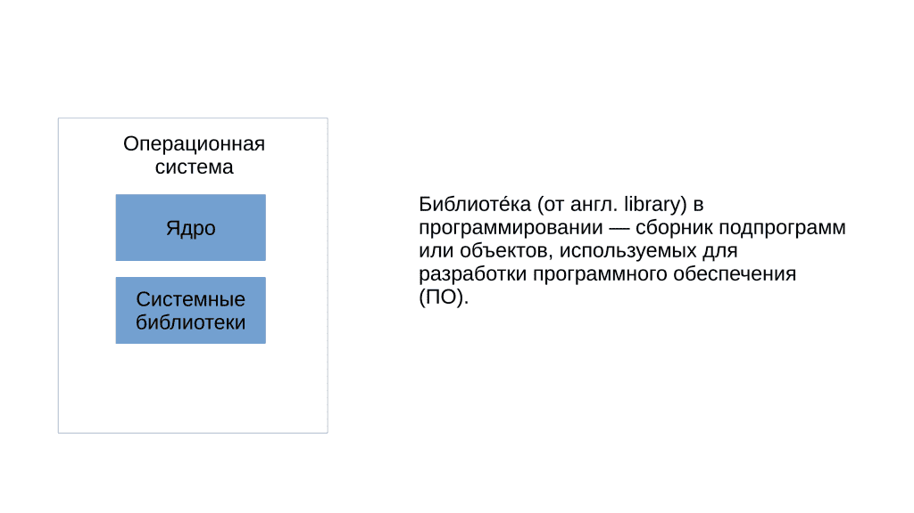

# 01. Operating systems and GNU-Linux

<iframe width="560" height="315" src="https://www.youtube.com/embed/BpEZgAw1lLU" title="YouTube video player" frameborder="0" allow="accelerometer; autoplay; clipboard-write; encrypted-media; gyroscope; picture-in-picture" allowfullscreen></iframe>

## The origin of operating system

In the past, when I was a child, if someone asked "what operating system do you have?" people would respond with "Pentium 4". But with the rise of mobile operating systems like Android and iOS, and the public rivalry between Apple and Samsung, more and more people have become familiar with the term "operating system". However, to fully understand this term, we need to look at the history of software and understand how and why it came to be and evolved. So let's take a look at the history of software.

In the past, computers were so large and expensive that only large organizations and institutions such as universities and research centers could afford them. At the same time, computers performed only one task at a time. By task, I mean an application program - a program that the user works with. For example, your browser, email client, text editor, or game - all of these are application programs. Although in those years, they were programs for scientific and engineering research.

So, typically, computers were installed in institutions and employees could wait a long time for their turn to work with the computer, like in a family with 10 children and 1 computer. Over time, computer power grew and there was a need to perform several tasks sequentially or in parallel, as well as the ability to work for several users at the same time. The concept of time-sharing was developed, based on which service programs were created that solved multitasking issues.

With the development of computer technology, these utility programs began to acquire more and more functions. If earlier programs interacted with hardware directly, now some tasks were taken over by utility programs. They became a kind of layer between application programs and hardware. This set of utility programs began to be called an operating system, one of the first implementations of which was called Multics. Based on its ideas, UNIX was created, which set standards for modern operating systems.

## What does it consist of?

An operating system is a layer between application software and hardware. However, an OS can be divided into three components:

- The kernel is a program responsible for several important functions. One of the key functions of the kernel is task scheduling, that is, determining which programs and in what order will be executed by the processor for maximum performance and efficiency, the same "time-sharing" concept. Another important function of the kernel is managing the RAM - the kernel decides when and what to load or unload from RAM. Additionally, the kernel is responsible for direct hardware interaction through special modules called drivers. When application software wants to work with hardware, for example, a game wants to process some data and display an image on the screen, it turns to the kernel, and the kernel sends the request through the driver to the video card. The kernel has other functions as well, but for now that's enough. It should be noted that there are different types of kernel architectures, and in this case, we have discussed the modular variant used in the Linux operating system.

- System libraries are an important part of the operating system that stores code, functions, and data used when launching and running applications. While administrators rarely interact with libraries directly, knowledge about them can be useful when troubleshooting application issues.

- Shell and utilities. One of the important functions of an operating system is to provide a user interface for interacting with the computer. The interface can be either graphical or text-based. Don't think that a text-based interface is some kind of window into the hidden world of the computer, through which you can do anything you want with the computer. Yes, a text-based interface is usually more functional than a graphical one, but it was written by people for people, and its functions are the same as those of a graphical interface - to allow you to run programs, work with files, etc. Modern operating systems contain hundreds of small programs called utilities, which can serve both the system itself for some internal maintenance tasks, as well as users for some basic functionality, as well as for diagnostics and problem-solving.

## GNU/Linux and distributions

Commercial companies developing operating systems give their products names such as Windows, MacOS, Android, or iOS. But in the case of GNU/Linux, things are a bit different. The kernel, called Linux, is developed by one group of people, or more precisely, thousands of people and companies, while libraries and utilities are created by hundreds of other people and companies. Some of them have been around since the 80s, while others appear and disappear every year. Usually, some basic utilities are developed by the GNU organization, and most of the other utilities and shells are released under the GNU GPL license (including the Linux kernel).

There are people and companies who take these components, combine them, and create a ready-to-use operating system. However, different people have their own visions and goals, resulting in many different variations of this operating system, which are called distributions. Ubuntu, Debian, CentOS, RedHat Enterprise Linux - these are all distributions that use GNU programs and the Linux kernel. There are distributions that differ only in the set of pre-installed programs and the graphical interface settings, and there are distributions that have a completely different approach to updates, support, and even the presence of some specific programs. But since all these distributions are based on GNU programs and the Linux kernel, they can be collectively referred to as GNU/Linux.

## Distribution of operating systems

Modern operating systems for personal computers are typically distributed in the form of special files with the extension ISO. This file, known as a "disk image," contains an operating system installer program, and to install it, you should write it to a disk or flash drive and boot your computer from that device. Despite the fact that it is possible to install multiple operating systems on one computer, a mistake during installation can lead to data loss, so the installation process should be approached with special care. We will discuss the main steps for installing an operating system in a separate section.

As a rule, GNU/Linux distributions can be downloaded from the official distribution websites for free and without any registrations, while commercial operating systems provide access to the file only after purchasing a license - a special document that allows the use of a copy of the software. Some operating systems are tightly bound to certain hardware, such as MacOS, but most can be installed on different hardware with the presence of drivers.

In this topic, I have provided the minimum necessary information about operating systems and GNU/Linux. I recommend paying attention to the "Useful Links" provided in the practice section of this chapter.