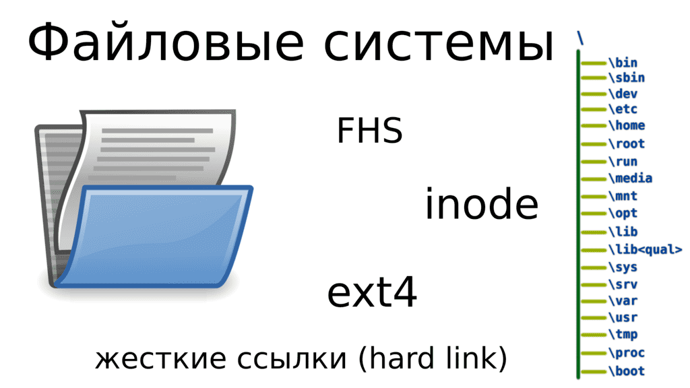
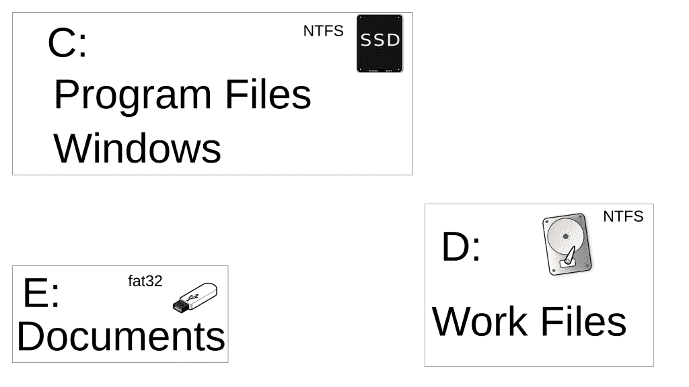
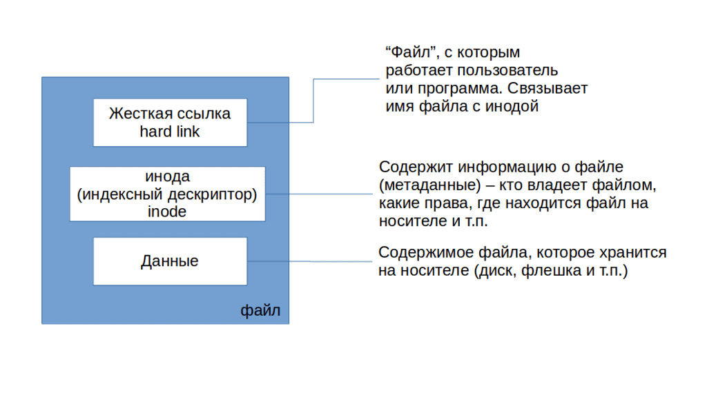

# 04. What are filesystems

<iframe width='560' height='315' src="https://www.youtube.com/embed/WOeZ-Tt3IkY" title='YouTube video player' frameborder='0' allow='accelerometer; autoplay; clipboard-write; encrypted-media; gyroscope; picture-in-picture' allowfullscreen></iframe>

A computer is a tool for working with information stored in the form of files. UNIX-like operating systems adhere to the idea of "Everything is a file," so devices, processes, directories, sockets, and pipes also act as files – but it is too early to discuss this. A modern operating system consists of tens or hundreds of thousands of files that need to be organized properly and provide users and programs with convenient access to them. For this purpose, a file system is used. However, this is quite a broad term that requires several perspectives to understand.

From the perspective of users or applications, a file system is a place for writing and reading files. Users see a hierarchical structure of file organization – files and other directories are stored inside directories, which can also contain files and directories. In Windows systems, directories are usually referred to as folders, but a folder is a term related to the graphical shell of the operating system, while a directory is related to the file system. You can change the icon, color, or add a description to a folder, which is not possible with a directory. Although Linux systems can also have a graphical interface, when people communicate, they usually refer not to the color or icon of a folder but to the contents and attributes of the file system, which is why the term "directory" is commonly used.

The structure of file organization on Windows systems and UNIX-like systems differs somewhat. In Windows, you have a certain file system that is assigned the letter C. Inside this file system, there are several directories – some containing user files, some containing programs, and others containing operating system files. When you connect a flash drive or any other device with its own file system, it is assigned a different letter, and through it, you can see the contents of that file system. The structures of these file systems are independent and do not intersect.

On UNIX-like systems, a different approach is used, known as the Filesystem Hierarchy Standard (FHS). According to this standard, many files and directories have specific paths where they should be stored. For example, when you install a program on Windows systems, all its files go into the directory C:\Program Files\ProgramName. On UNIX-like systems, most programs are "spread throughout the system" – the executable part of the program goes into the directory /usr/bin/, program shortcuts go into /usr/share/applications/, settings go into /etc/, and so on. Besides convenience, this also helps with security when properly configured.

This difference is derived from the fact that on UNIX-like systems, there is only one root. The root, in terms of structure, is the beginning of the filesystem where the first directories are stored. On Windows, each filesystem has its own root – C:, D:, etc. On UNIX-like systems, each filesystem is "attached," or more precisely, mounted, to some directory within a unified root. For example, you may have the root filesystem on an SSD, user files stored on a separate disk, and their access could be in the /home directory. Your documents, which you keep on a flash drive, may be accessible in the /home/user/Documents directory. Three different devices, three different filesystems, but all within one root.

Returning to the topic of security, different filesystems can be mounted with different mounting options. For instance, if your /home directory, where user files are usually stored, is on a separate filesystem, you can prohibit program execution on this filesystem. Programs are usually located in the /usr/bin/ directory, which regular users do not have access rights to. As a result, if a user downloads a virus into their home directory (/home/user), they simply won't be able to execute it. Or, let's say we know that program files are located in /usr/. If we separate /usr/ onto another filesystem, after installing all the programs, we can remove the write permission from this filesystem. As a result, a virus won't be able to exploit a vulnerability in the program to modify its executable file and add malicious code to it. And during an update, we simply return write permission to the filesystem, update the programs, and then revert it back as it was.

As you may have noticed, I mentioned filesystems from two perspectives – when talking about filesystems on devices and when discussing options for execution or writing. From the device perspective, a filesystem is a method of reading and writing files on a storage device. It is not enough to simply write a file to a disk; you also need to determine where to write the file, how to work with it, and so on. This depends on the type of filesystem – NTFS, exFAT, EXT4, XFS, etc. A file can be conditionally divided into three parts – the actual data inside the file, the hard link, and the information about the file – where the data of the file is stored on the device, who owns it, what access rights it has, and so on. The information about the file is called metadata and is stored on UNIX-like systems in data structures called inodes. Each inode has its unique number, and to find an inode by a file name, the operating system uses a hard link. In summary, the files we usually see on a computer are hard links that contain the inode number, and the inode contains information about the file and its location on the device. Several of these hard links, which point to the same inode, can exist; essentially, this is a way to access the same file by different names and from different directories, but within the same filesystem, because the hard link is a part of the filesystem. When you delete the last hard link to a file, the filesystem clears the inode entry and marks the location of the file data as free, even though the data is still there. Until new data is written to that location, there is a chance to recover this data.

From the perspective of the operating system, a filesystem is a driver, a kernel module. This driver provides an interface through which programs can interact with files. When mounting a filesystem, you can specify special mounting options, for example, to make the filesystem read-only. On GNU/Linux systems, it is possible to install modules to work with various types of filesystems, including filesystems from other operating systems, such as NTFS. However, NTFS lacks certain features required for Linux operation, such as UNIX-like permissions, etc., so it is not possible to install Linux on NTFS, although you can use such a filesystem for storing user files. On the other hand, Windows systems do not have the necessary drivers to work with filesystems like EXT4 or XFS, which are typically used for installing Linux. As a result, if you have both operating systems on your computer, Windows can see Linux files, but to view the contents of Linux filesystems on Windows, you need to install special utilities.

There are many different types of filesystems, each with different functionality and capabilities, but the most commonly used filesystems on GNU/Linux are ext4 and xfs. Now I've only explained what a filesystem is so that we can explore working with files in the next videos. We will come back to the topic of "Working with Filesystems" later.