# 30. bash скрипты №4

<iframe width='560' height='315' src="https://www.youtube.com/embed/CKAah_DsCJ8" title='YouTube video player' frameborder='0' allow='accelerometer; autoplay; clipboard-write; encrypted-media; gyroscope; picture-in-picture' allowfullscreen></iframe>

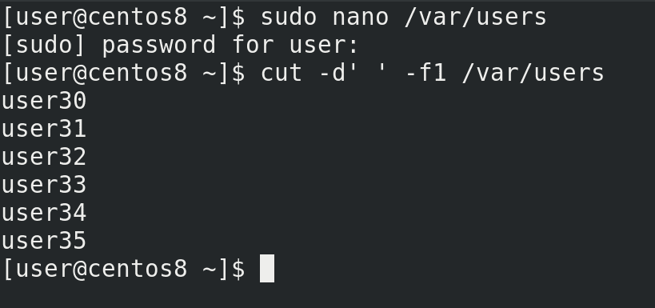

В прошлый раз мы остановились на том, что создали файл и в скрипте добавили возможность брать данные о пользователе и группе из этого файла. Теперь же попробуем в файле указать несколько пользователей:

```
sudo nano /var/users
```

и добавить их разом. Выполнив ту же команду cut:

```
cut -d' ' -f1 /var/users
```

мы увидим весь список пользователей. Если передать команде useradd такой список пользователей, она этого не поймёт – useradd может добавлять только по одному пользователю за раз. А значит нам нужно будет для каждой строчки запускать отдельный useradd.

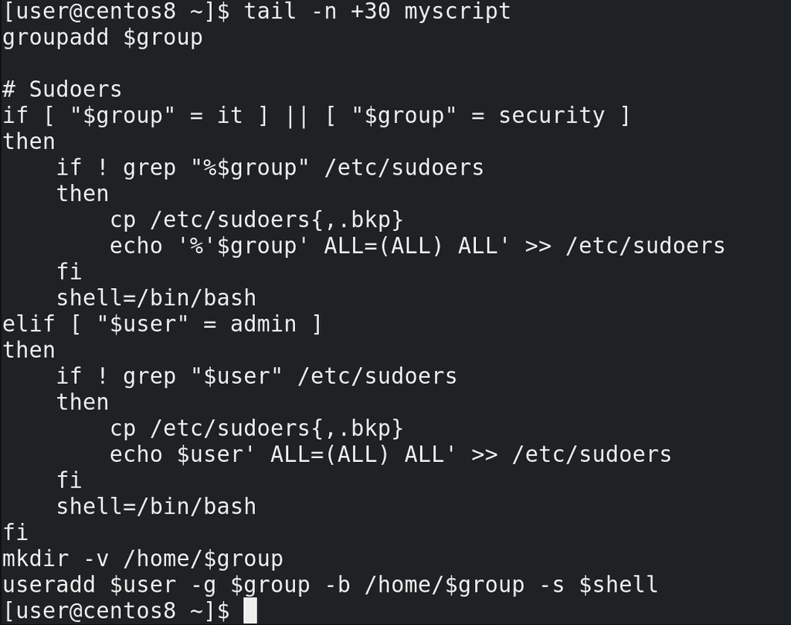

И так, задача у нас такая – для каждой строчки в файле /var/users создавать группу, проверять sudoers и создавать пользователя. То есть всё что ниже 30 строчки:

```
tail -n +30 myscript
```

Если речь про повторное запускание одной  и той же команды – то речь обычно о циклах. Есть две стандартные команды для работы с циклами – for и while. for обычно связан со списком, а while – с условием, хотя нередко можно использовать и ту, и другую. Давайте начнём с for. Синтаксис такой:

```bash
for переменная in список значений
do команды
done
```

При запуске команды переменная получит первое значение из списка значений, потом выполнятся все команды, а после команд переменная получит второе значение из списка значений и опять выполнятся все команды. И так будет повторяться до тех пор, пока не закончатся все значения в списке, после чего цикл завершится. Каждое повторение называется итерацией.


Давайте посмотрим пример:

```
nano for
```

```bash
for number in 1 two "line № 3"
do echo This is $number
done
```

```
chmod +x for
./for
```

Как видите, сначала переменная number получила первое значение – 1, выполнилась команда echo. Потом переменная number взяла второе значение – two. Ну и так далее. Вроде ничего сложного.

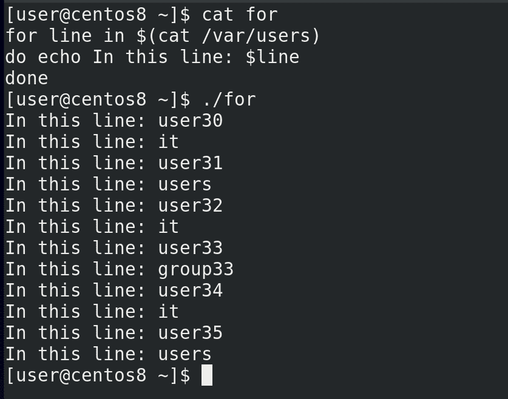

Список значений можно задать по разному, например, взять его из вывода команды:

```
nano for
```

```bash
for line in $(cat /var/users)
do echo In this line: $line
done
```

```
sudo ./for
```

Но вместо того, чтобы увидеть в виде значения каждую строчку, мы видим пользователя и группу на разных строчках. То есть цикл сначала присвоил переменной line в виде значения имя первого юзера, а после итерации значение переменной стало имя группы. И так с каждой строчкой. То есть, вместо того, чтобы разделять значения построчно, значения разделялись по пробелам.

Помните, мы в команде cut использовали опцию -d – разделитель:

```
sudo cut -d' ' -f1 /var/users
```

И мы этой опцией указали, что разделителем является пробел. bash, чтобы взять список значений, тоже использует разделитель – сначала он попытается разделить значения по пробелу, потом по табуляции и только потом по переводу строки. А чтобы bash в качестве разделителя использовал сразу перевод строки, нам нужно об этом ему сказать. Для этого есть переменная IFS – внутренний разделитель полей.


Чтобы указать, что мы хотим в качестве разделителя использовать перевод строки, даём переменной такое значение:

```
IFS=$'\n'
```

\n – это newline. Если захотим знак табуляции меняем n на t:

```
IFS=$'\t'
```

Если брать, например, /etc/passwd, то там разделителем выступает двоеточие, тогда можно указать так:

```
IFS=:
```

Но с этой переменной нужно быть осторожным – другие команды в скрипте также могут использовать эту переменную, а значит то что у вас работало с пробелами, может начать работать с новыми строками. И чтобы не пришлось переделывать пол скрипта, мы можем поменять эту переменную временно, а потом вернуть старое значение. Но для этого нужно старое значение предварительно сохранить:

```
oldIFS=$IFS
```

А после выполнения нужных команд можем восстановить старое значение:

```
IFS=$oldIFS
```

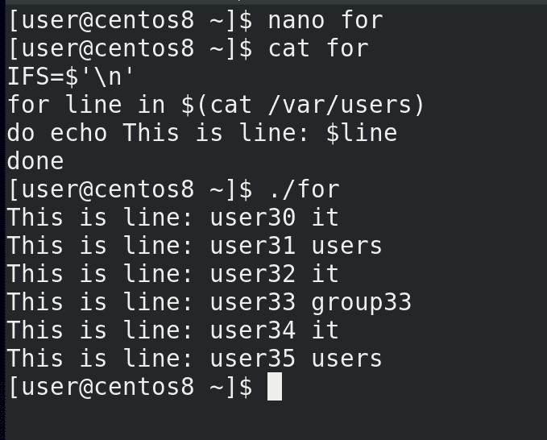

Но нам сейчас нужен newline:

```
IFS=$'\n'
```

Попробуем запустить скрипт:

```
sudo ./for
```

Теперь всё окей – при каждой итерации переменная будет получать в качестве значения целую строчку.

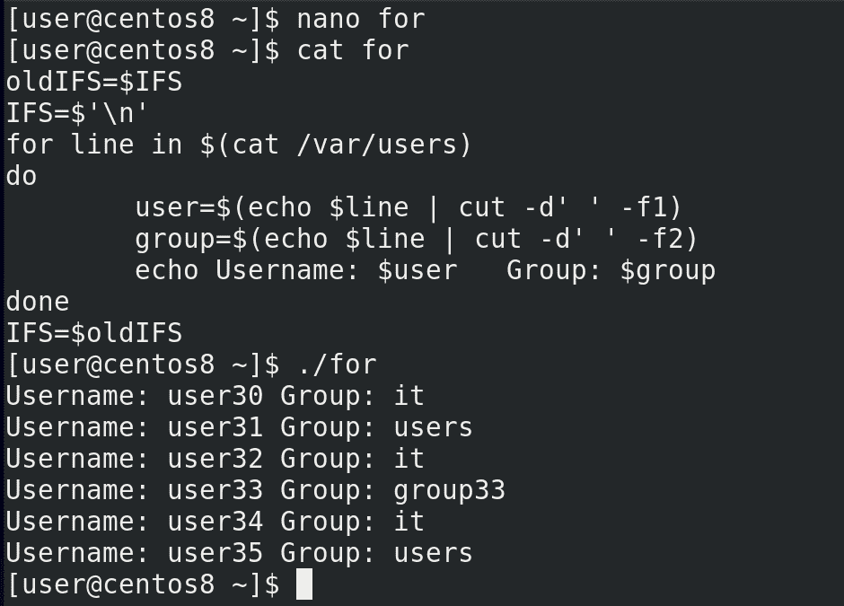

Дальше нужно просто из этой переменной достать имя пользователя и группы, допустим, с помощью того же cut. А чтобы передать команде cut значение переменной, можно использовать пайп:

```
echo $line |  cut -d' ' -f1
```

В итоге мы достанем из строчки имя пользователя. И чтобы это имя стало переменной, напишем так:

```
user=$(echo $line | cut -d' ' -f1)
```

Тоже самое с группой:

```
group=$(echo $line | cut -d' ' -f2)
```

Последний штрих:

```
echo Username: $user Group: $group
```

```
sudo ./for
```

Как видите, всё сработало как надо. Теперь попытаемся сделать тоже самое с нашим скриптом.

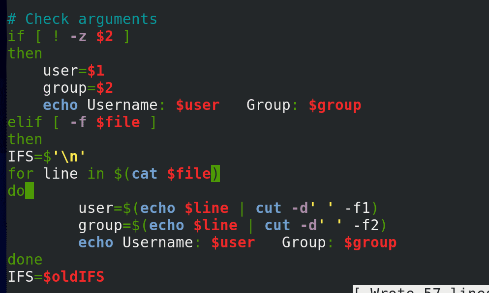

Предварительно сохраним значение переменной IFS:

```
oldIFS=$IFS
```

Тут у нас уже есть строчки назначения переменных из файла, но это нам не подходит, потому что нам нужно брать переменные в цикле, поэтому эти строчки убираем. Попробуем вписать сюда наш цикл:

```bash
IFS=$'\n'
for line in $(cat $file)
do 
  user=$(echo $line | cut  -d' ' -f1)
  group=$(echo line | cut -d' ' -f2)
  echo Username: $user Group: $group
done
IFS=$oldIFS
```

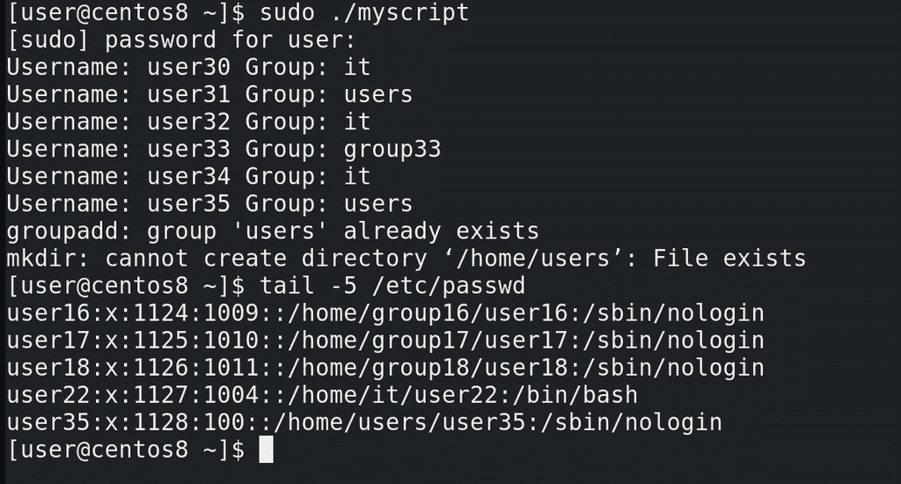

Запустим и проверим:

```
sudo ./myscript
tail -5 /etc/passwd
```

У нас там было несколько пользователей, а создался только последний. Подумайте, почему так случилось?

Обратите внимание на наш цикл – переменные получают свои значения, выполняется команда echo, а после итерации всё происходит заново, пока не дойдёт до последнего значения. И только после этого начинают выполняться все остальные  команды – группы, sudoers и т.д. Нам же нужно, чтобы с каждой итерацией выполнялись все эти команды.

Что мне мешает поставить done в конце скрипта? Мы сейчас находимся в условии – я не могу просто посреди for закончить условие if и продолжить выполнять команды for. Команда началась внутри условия – там же она должна закончится. Есть вариант скопировать все оставшиеся команды сюда. Но это плохой вариант – это увеличит размер скрипта, в дальнейшем придётся редактировать команды и внутри цикла, и отдельно.

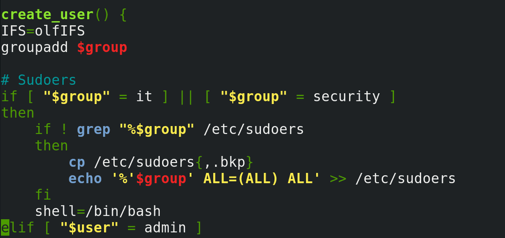

Вот у нас есть куча команд и я не хочу, чтобы они повторялись в скрипте в нескольких местах. Чтобы решить эту проблему, я могу объединить все эти команды под одним названием. Для этого я пишу название, допустим: create\_user() - ставлю после названия скобки, а потом внутри фигурных скобок указываю все нужные команды:

```
create_user()   { 
  groupadd …
                }
```

Это называется функцией. И в дальнейшем, когда я захочу запустить все эти команды, я просто запущу команду:

```
create_user
```

Но функция должна быть задана до того, как к ней обращаются, поэтому переместим нашу функцию наверх, скажем, после переменных. Но тут ещё один нюанс – IFS возвращает старое значение:

```
IFS=$oldIFS
```

после выполнения цикла, а значит после выполнения всех команд в функции. А так как все наши команды там, то лучше перенести эту команду:

```
IFS=$oldIFS
```

в начало функции.


А теперь пропишем её в наших условиях – просто написав create_user в командах каждого из условий.

Хорошо, давайте пройдёмся по скрипту. Вначале мы проверяем на root права. Задаём переменные. Создаём функцию – create_user – тут у нас все нужные команды для создания группы и пользователя. А в конце у нас проверка, как мы запускали программу – с параметрами, с файлом или интерактивно – в зависимости от этого назначаются переменные и запускается функция.


Окей, давайте протестируем:

```
sudo ./myscript
tail -5 /etc/passwd
```

Как видите, все пользователи создались, всё работает.

Теперь немного проработаем наше интерактивное меню, то есть опцию else. Сейчас, при запуске скрипта, в этом режиме оно запросит юзернейм, пароль, создаст пользователя и закроется. Я бы хотел, чтобы после создания пользователя наш скрипт не завершался, а предлагал заново создать пользователя и всякие другие менюшки. Для этого мне понадобятся две команды. Первая будет показывать меню – это команда select. Синтаксис чем-то похож на for:

```bash
select переменная in список значений
do команды
done
```

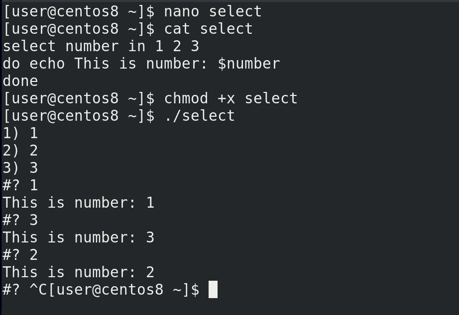

Например:

```
nano select
```

```bash
select number in 1 2 3
do echo This is number: $number
done
```

```
chmod+x select
./select
```

select показал нам меню, где с помощью цифр мы можем выбрать какое-то из значений и переменная получит это значение. Дальше выполнится команда и после неё опять появится меню.

Теперь мне нужна команда, которая будет запускать какие-то команды в зависимости от значения переменной. Речь про команду case. Синтаксис такой:

```bash
case $переменная in
    значение 1) команды;;
    значение 2) команды ;;
    *) команды, если значения нет в списке ;;
esac
```

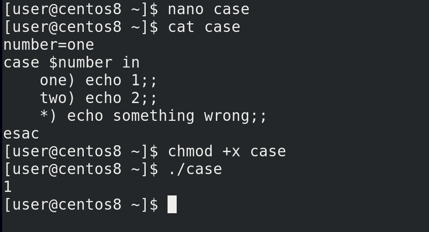

Например:

```
nano case
```

```bash
number=one
case $number in
    one) echo 1;;
    two) echo 2;;
    *) echo something wrong ;;
esac
```


```
chmod +x case
./case
```

Как видите, значение переменной было one. Оно подошло под первую опцию, в следствии чего сработала первая команда.

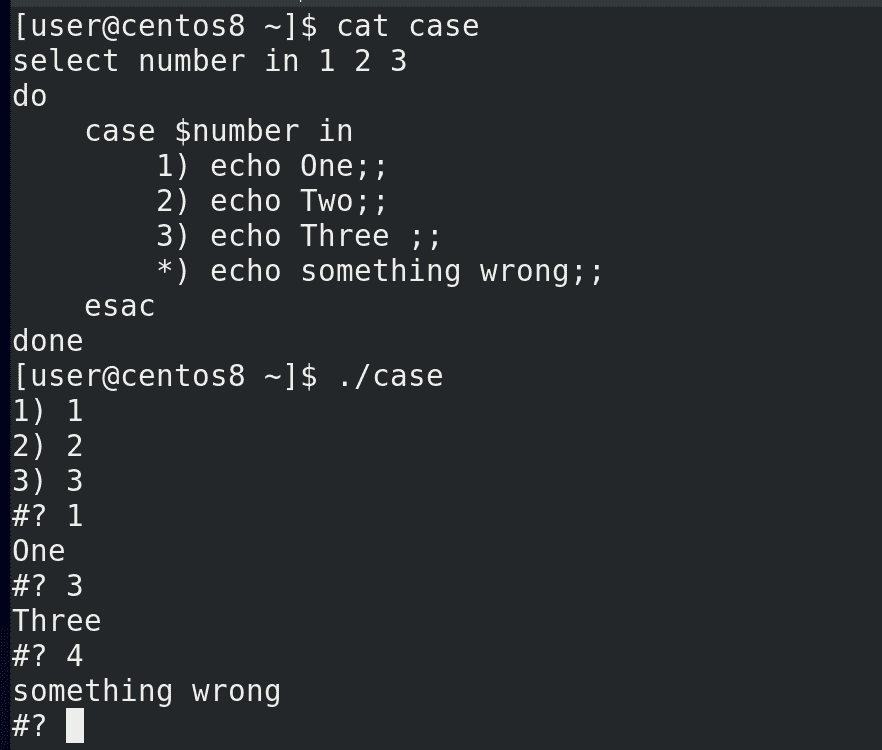

Теперь объединим select и case. Например:

```bash
select number in 1 2 3
do  
  case $number in
    1) echo One;;
    2) echo Two;;
    3) echo Three;;
    *) echo something wrong ;;
  esac
done
```

```
./case
```

Теперь, select предлагает нам выбрать одно из значений, это значение назначается переменной number, затем case, в зависимости от значения переменной, запускает соответствующую команду.

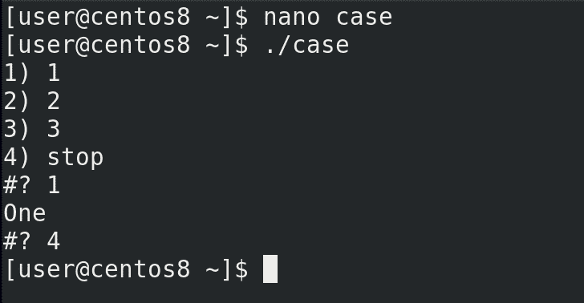

А чтобы не застрять в бесконечной петле, в списке опций пропишем что-нибудь типа stop, а в case используем команду:

```
break
```

чтобы прекратить цикл. После break цикл прерывается и начинают выполняться другие команды после цикла:

```
./case
```

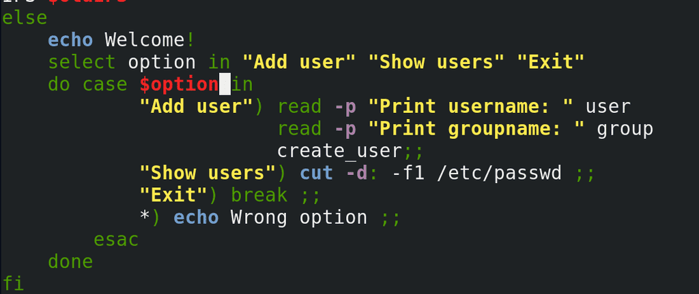

Теперь добавим это в нашем скрипте. Допустим, сделаем так, чтобы можно было добавить пользователя, посмотреть текущих пользователей, либо выйти:

```bash
select option in "Add user" "Show users" "Exit"
do 
  case $option in
    "Add user") read -p … ;;
    "Show users") cut -d: -f1 /etc/passwd ;;
    "Exit") break ;;
    *) echo Wrong option ;;
  esac
done
```

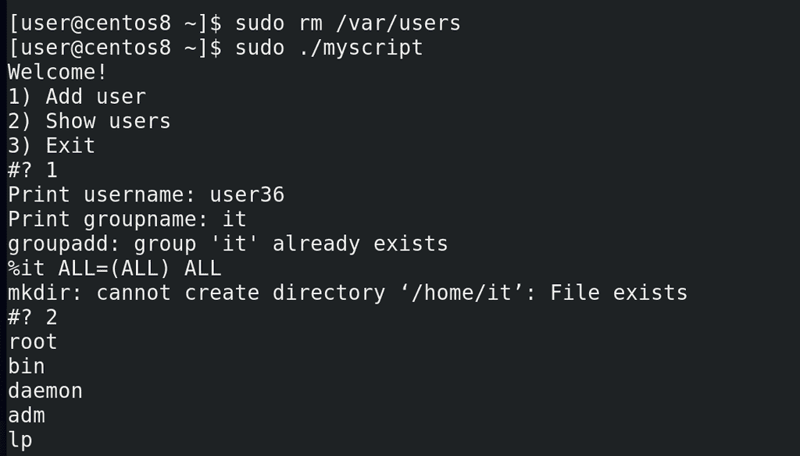

Сохраним, удалим файл:

```
sudo rm /var/users
```

чтобы наш скрипт предложил интерактивное меню и попробуем запустить скрипт:
 
```
sudo ./myscript
```

Выбираем опцию 1 – у нас выходит приглашение ввести имя пользователя и группу. Окей, нажимаем enter – меню появилось ещё раз. Теперь выбираем 2 – и видим список всех пользователей. Выбираем 3 и выходим.

Подводя итоги, сегодня мы с вами разобрали команду for, с помощью которой мы можем создавать циклы; переменную IFS; функции, с помощью которых можем вызывать одну или несколько заранее прописанных команд; команду select, с помощью которой мы можем создать интерактивное меню; и команду case, с помощью которой мы можем запускать команды в зависимости от значения переменной.
