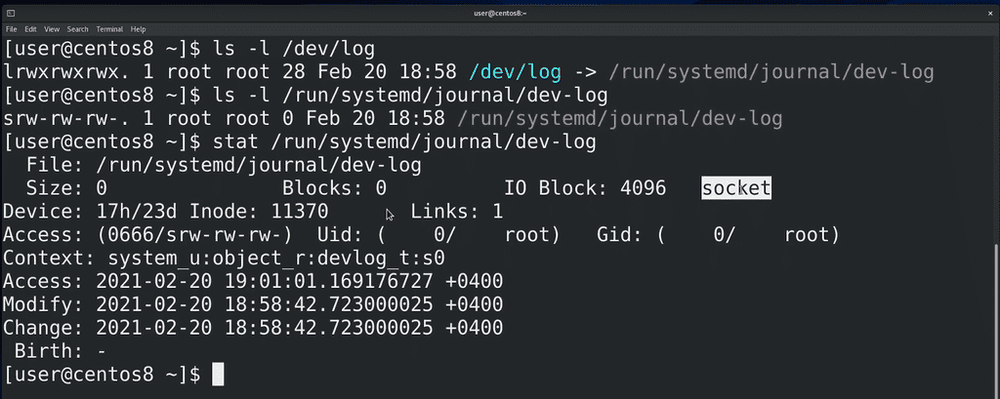
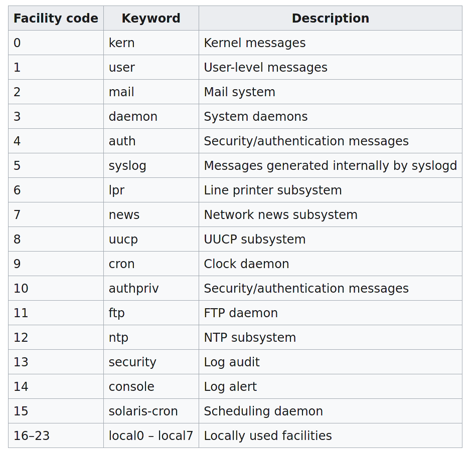
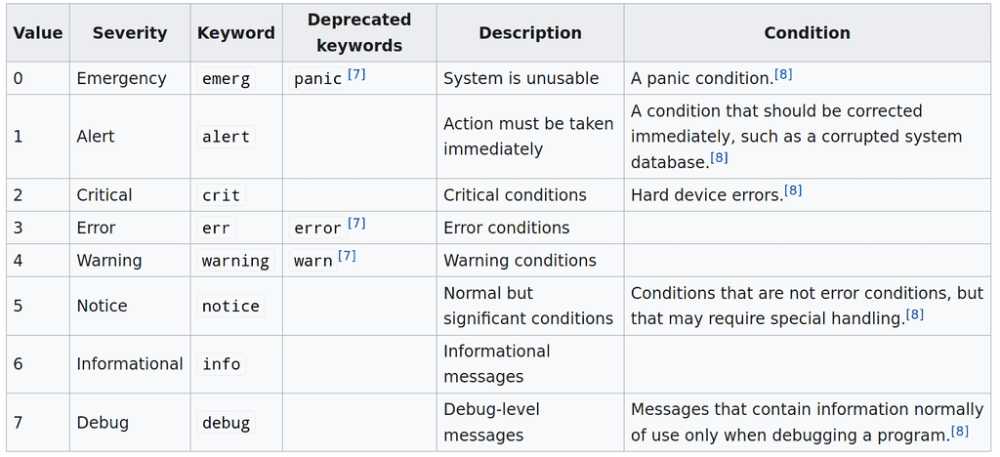
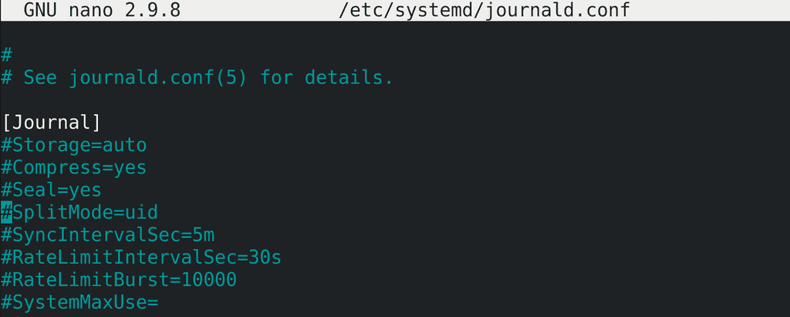
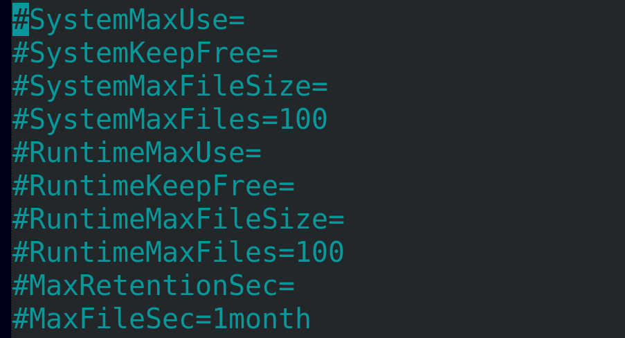
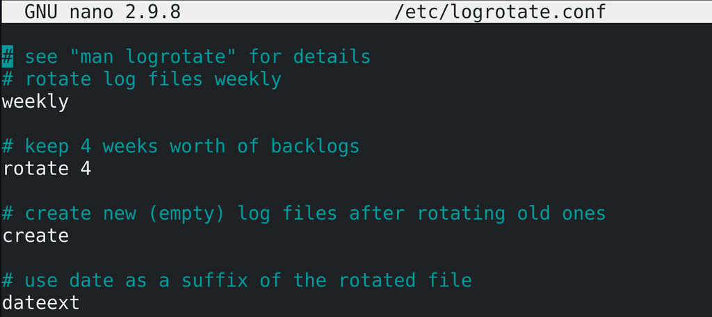
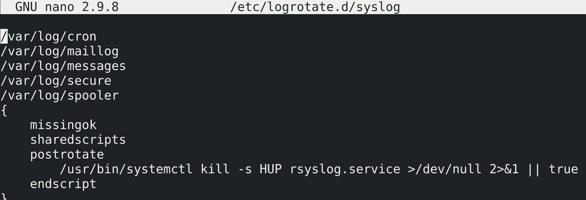
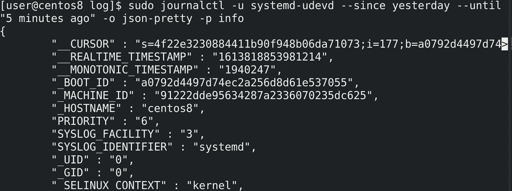

# 36. Логирование

<iframe width='560' height='315' src="https://www.youtube.com/embed/iVf7clPG9fE" title='YouTube video player' frameborder='0' allow='accelerometer; autoplay; clipboard-write; encrypted-media; gyroscope; picture-in-picture' allowfullscreen></iframe>


Когда вы запускаете какую-то программу в текстовом интерфейсе, как правило, вы видите вывод этой команды, будь то нужная информация или какие-то ошибки:

```
ls /tmp /temp
```

Но всякие демоны запускаются сервисным менеджером и работают на фоне, из-за чего их вывод не виден пользователю. Как я говорил, настройка и обеспечение работы демонов - одна из главных задач администратора. А значит очень важно видеть какие ошибки выдаёт программа, да и информационные сообщения также важны. Скажем, количество просмотров на youtube - это тоже сообщения, которые генерируют демоны. И весь этот вывод, будь то ошибки или полезная информация, называется логами.

У большинства демонов есть свои настройки логов и они, в некотором роде, уникальны. Возьмём, для примера, веб сервер. Это программа, которая отвечает за работу сайтов. И на одном веб сервере можно держать несколько сайтов. Так вот, настройки для этого демона позволяют хранить информацию о подключениях на разные сайты в разных файлах. Но это относится к веб серверу, у других сервисов могут быть свои особенности. Поэтому, если вам важны логи определённого сервиса, нужно искать информацию именно про этот сервис. Но логи большинства программ вы даже не просмотрите. Они не так важны и нужны довольно редко, допустим, когда возникла проблема.



И так, программы посылают свои логи в stdout, stderr и в какие-то файлы, указанные в настройках самих программ. Кроме этого, для логов существует стандарт отправки сообщений о событиях, называемый syslog. Операционная система даёт возможность программам посылать свои логи с помощью функции syslog в специальный файл /dev/log:

```
ls -l /dev/log
ls -l /run/systemd/journal/dev-log
```

Обратите внимание на первый символ - s. Мы с вами разбирали некоторые типы файлов, это - ещё один тип файла, называемый сокетом. Сокеты используют для взаимодействия между процессами. Таким образом, когда какая-то программа отправляет логи в /dev/log, они передаются демону, стоящему за этим файлом. Этот сокет файл dev-log принадлежит процессу демона journald:

```
man systemd-journald
```

journald - это программа, отвечающая за логи. Кроме syslog сообщений, journald также перехватывает stdout и stderr сервисов, запущенных в systemd.

До journald основным демоном для syslog был rsyslog. Собственно, он стоял за /dev/log и собирал все логи, а дальше, на основе своих настроек, решал, что делать с этими логами - писать в файлы, выводить на экран, посылать по почте и всё такое. На самом деле rsyslog и сейчас работает, вместе с journald:

```
systemctl status rsyslog
systemctl status systemd-journald
```

Только теперь логи собирает journald, а потом делиться ими с rsyslog. Причём, где-то может быть наоборот - логи получает syslogd, а потом отправляет на journald. А где-то может не быть rsyslog-а или journald - это зависит от дистрибутива.


Но зачем два демона, отвечающих за логи? Всё дело в подходе к хранению логов. rsyslog, при получении логов, смотрит параметры лога и на основе этого записывает их в различные файлы в директории /var/log:

```
ls /var/log
```


К примеру, почти все логи от rsyslog записываются в файл /var/log/messages:

```
sudo tail /var/log/messages
```

Т.е. это просто текстовые файлы, которые можно прочесть и обработать с помощью различных утилит и скриптов. С одной стороны это плюс - с текстовыми файлами работать проще. Но обычно логов много и попытка найти что-то конкретное в большом текстовом файле может оказаться непростой задачей. И когда речь идёт о большом количестве данных, обычно их записывают в базы данных. Там они хранятся в структурированном виде и найти что-то определённое становится гораздо проще. Такой подход предлагает journald. При этом получается более гибко работать с логами, но логи перестают быть текстовыми и появляется зависимость от определённой утилиты, которая и работает с логами.  И если на домашних компьютерах это не так критично, то в компаниях могут быть ситуации, когда какие-то задачи завязаны на скриптах, которые ориентируются на текстовые логи - и просто отказаться от текстовых логов будет слишком болезненно.


Ещё важный момент - в компаниях зачастую стоят централизованные syslog сервера, на которые посылаются логи со всех серверов и различного оборудования. И для посылки логов syslog на централизованный сервер по сети нужен демон, который это поддерживает. У journald с этим неопределённость - вроде они что-то разрабатывали для этого, можно даже скачать и скомпилировать, но какого-то функционала нет, как и упоминаний в официальной документации от Red Hat. А rsyslog это поддерживает, что является ещё одной причиной не отказываться от него. Хотя, справедливости ради, journald может посылать логи на другой сервер journald, что также можно использовать для центрального хранения логов, но только от линуксов с journald. Поэтому и используются оба демона - один может отправлять по сети и записывать в текстовые файлы(rsyslog), а второй более удобный и гибкий(journald).


Начнём с rsyslog. Его основной файл настроек - rsyslog.conf:

```
sudo nano /etc/rsyslog.conf
```

По началу мы видим использование двух модулей - imuxsock и imjournal - в которых можно настроить, будет ли rsyslog создавать сокет файл, куда будут посылаться логи из программ или перенаправляться с journald, либо будет ли сам rsyslog подтягивать файлы из журналов journald.


Снизу у нас правила - какие логи в какие файлы записывать. О чём здесь речь?



У стандарта syslog есть объекты логирования. Что-то вроде меток, по которым можно ориентироваться в логах. Например, kern - по нему можно понять, что логи относятся к ядру. Либо mail - логи, связанные с почтой. Также есть 8 объектов - local0 - local7 - это кастомные, которые можно использовать в своих целях, например, для своих скриптов или программ, которые не подходят под перечисленное.



Кроме объектов есть уровни серьёзности. По ним можно понимать, насколько важное сообщение в логе, что позволяет отсортировывать обычные сообщения от ошибок, всяких проблем и сбоев.


Теперь, взглянув в rsyslog.conf, можно понять и даже самим написать правила. Например, authpriv.*: authpriv - это логи, связанные с безопасностью и аутентификацией; * - это логи любого уровня серьёзности - будут записываться в /var/log/secure. Или, например, первая строчка - *.info; mail.none; authpriv.none; cron.none - логи любых объектов уровня серьёзности info, кроме тех, что связанны с почтой, аутентификацией или планировщиком задач cron - будут записываться в /var/log/messages. Обратите внимание на дефис перед -/var/log/maillog - он говорит о том, чтобы не записывать на диск изменения при каждом новом логе.


Обычно когда вы изменяете какой-то файл, изменения на файловой системе происходят в оперативке, а потом синхронизируются с диском. А так как жёсткий диск работает медленнее, чем оперативка, то убеждаться в сохранении каждого лога того же почтового демона будет создавать проблему с очередью, так называемый bottleneck. Для этого и нужен дефис перед файлом - так новые логи будут копиться какое-то время в оперативке, прежде чем разом записаться на диск. Кстати, процесс синхронизации изменений в оперативке и с диском можно запустить и вручную, с помощью команды sync. Это касается не только логов, но и любых изменений.


Ещё одна примечательная запись - *.emerg - как видите, здесь указан не файл. Вместо него модуль rsyslog-а, который будет выводить сообщение залогиненным пользователям в виртуальную консоль.


Тут много различных опций и возможностей, всё зависит от ваших задач. Не забудьте - после изменения настроек следует рестартнуть сервис rsyslog:

```
sudo systemctl restart rsyslog
```



Теперь перейдём к демону journald:

```
sudo nano /etc/systemd/journald.conf
```

Тут довольно много опций и все разбирать смысла нет, но при желании можно найти информацию о каждом параметре с помощью man journald.conf. Но кое-какие ключи мы всё же разберём. Например, Storage.


Если значение auto, то journald проверяет наличие директории /var/log/journal. Если она есть - то хранит там логи. Если же директории нет, то логи хранятся в оперативке, соответственно, при перезагрузке все логи стираются. Если мы хотим, чтобы логи сохранялись, то достаточно просто создать директорию:

```
sudo mkdir /var/log/journal
```


Ещё одна примечательная опция - SplitMode. При значении uid для каждого обычного пользователя создаётся отдельная база с его логами и автоматом выдаются нужные права, чтобы пользователь мог просматривать свои логи.



Также здесь есть настройки того, сколько хранить логи, сколько разрешено логам заниматься пространства файловой системы и т.п. Например, SystemMaxUse даёт ограничение на используемое логами пространство. По умолчанию это 10% от файловой системы, а если файловая система большая, то не более 4 Гигабайт. Когда файл логов достигнет максимального значения, старые логи будут удаляться автоматически. SystemMaxFileSize позволяет по достижению какого-то объёма выносить старые логи в другую базу, которую вы можете потом перенести куда-нибудь в архивные логи. MaxRetentionSec - сколько времени хранить логи. Скажем, размер логов не достиг максимального значения, но при этом вам не нужны логи старее месяца. Опять же, в конфиге много различных опций, зачастую названия говорят за себя, а если что не понятно - смотрите в мане. Ну и после каких-либо изменений - sudo systemctl restart systemd-journald.

Раз уж мы заговорили о размерах файлов и времени их хранения, как с этим обстоят дела у rsyslog? Как правило, для rsyslog-а этим занимается программа logrotate. Т.е. rsyslog пишет логи, а logrotate удаляет старые логи, следит за размером и всё такое. Собственно это и называется ротация логов.



У logrotate есть основной файл настроек - logrotate.conf:

```
sudo nano /etc/logrotate.conf
```

Здесь обычно хранятся значения по умолчанию. Например, weekly - по умолчанию logrotate будет ротировать логи раз в неделю. rotate 4 - ротаций будет 4.


Для примера посмотрим содержимое /var/log, например /var/log/secure. Лог недельной давности logrotate переименовал в другое название, а вместо него оставил чистый secure. И так он делает 4 раза. Когда старых логов уже будет 4 и понадобится опять ротировать, он удалит самый старый лог, чтобы у нас старых логов было на месяц. Собственно, rotate 4 об этом и говорит. А опция dateext, как вы видите, добавляет к старым логам дату их ротации.


Но выше были лишь дефолтные настройки, а к каким логам они применяются и кастомные настройки этих лог файлов указываются в директории /etc/logrotate.d. Для примера посмотрим /etc/logrotate.d/syslog:

```
sudo nano /etc/logrotate.d/syslog
```



И здесь мы видим, что для такого-то списка файлов применяются такие-то опции. В фигурных скобках мы можем поменять дефолтные настройки на свои, например, выставить количество ротаций, периодичность и т.п. Тут также можно задать какие-то скрипты, которые будут выполняться перед или после ротации, так как некоторые сервисы могут этого требовать, чтобы увидеть новый файл логов.


Теперь касательно просмотра логов. Для этого используется утилита:

```
journalctl
```

Обычный пользователь может смотреть только свои логи, для системных логов понадобится sudo. Впрочем можно настроить права на файлы логов, чтобы пользователи какой-то группы, например, systemd-journal, могли просматривать все логи.


Просто запуск journalctl выведет вам огромное количество логов, что редко нужно. Чаще всего важнее посмотреть логи за последнее время:

```
sudo journalctl -e
```

И так, что мы видим обычно в логах? В первом столбце - дата и время лога, во втором - имя компьютера, в третьем - программа, которая отправила этот лог, а также её pid, ну а дальше само сообщение лога.


Ещё чаще хочется посмотреть логи по какому-то сервису. Причём не все логи, а только последние:

```
sudo journalctl -eu systemd-udevd
```

Здесь под -u имеется ввиду unit systemd.


Чтобы смотреть логи в реальном времени, по мере их добавления, следует использовать ключ -f. Опять же, комбинируем с каким-нибудь unit-ом для удобства:

```
sudo journalctl -fu sshd
```


Можно посмотреть логи запуска операционной системы:

```
sudo journalctl -b
```



Также можно гибко выбрать временной промежуток, настроить формат вывода, уровень серьёзности и т.п. Но разбирать или учить все ключи нет необходимости, так как всегда можно посмотреть документацию и найти нужное для конкретной задачи.


Ну и напоследок. Есть утилита logger, которая позволяет вам отправлять логи в syslog, что можно использовать, например, в скриптах или для тестирования работы syslog сервера:

```
logger -p news.alert "Hello World!"
```

Подводя итоги. Мы с вами разобрали логирование в Linux - поговорили про работу демонов rsyslog и journald, про ротацию логов с помощью настроек journald и утилиты logrotate, затронули утилиту sync, а также рассмотрели утилиту journalctl. Умение работать с логами очень важно для администратора, это основа его работы.
