# 37. Планировщики задач

<iframe width='560' height='315' src="https://www.youtube.com/embed/JyZx56hhws4" title='YouTube video player' frameborder='0' allow='accelerometer; autoplay; clipboard-write; encrypted-media; gyroscope; picture-in-picture' allowfullscreen></iframe>

В задачи администратора входит настройка и поддержка IT инфраструктуры. Под поддержкой подразумевается регулярное выполнение обслуживающих задач, например, проверка состояния серверов, обновление операционной системы, бэкапы и всё такое. При  изучении скриптов мы разобрались как можно упростить некоторые задачи. А если автоматизировать запуск скриптов и команд для обслуживания, появится много свободного времени для других задач. В этом нам помогут несколько утилит, которые можно объединить под общим термином "планировщик задач".


Первая утилита:

```
at
```

Она позволяет выполнять какие-то команды в будущем, в заданное время. Это годится для нерегулярных задач, которые нужно выполнить один или пару раз.

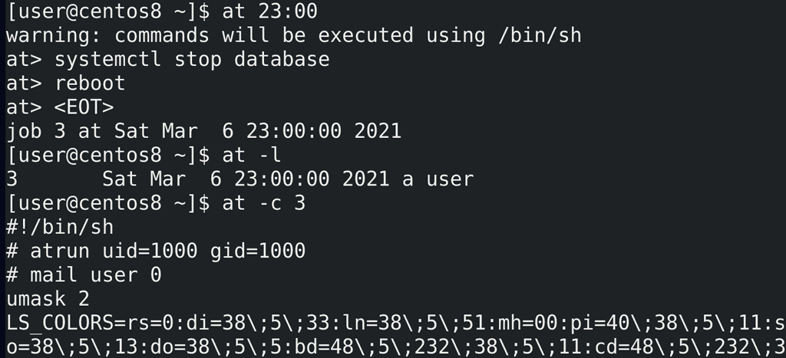


Предположим, нам нужно, чтобы сервер перезагрузился в 11 вечера. Для этого пишем:

```
at 23:00
```

После этого at предложит нам ввести список команд. Например, надо остановить сервис базы данных и только потом перезагрузиться - пишем одну команду, Enter, потом другую:

```
systemctl stop database
reboot
```

После чего нажимаем Enter и Ctrl+d, чтобы остановить ввод команд. На экране мы видим, что создалась задача - job - с номером 3, которая выполнится сегодня в 11 вечера. Задач может быть несколько, и чтобы увидеть список всех задач, можно выполнить команду:

```
atq
at -l
```

Чтобы увидеть детали задачи, пишем:

```
at -c 3
```

3 - номер задачи. Команды выполнятся от нашего пользователя, но так как это скрипт, причём, запускаемый из оболочки shell, at скопировал наши переменные окружения в этот скрипт, чтобы избежать каких-либо проблем. В самом низу скрипта мы увидим наши команды.

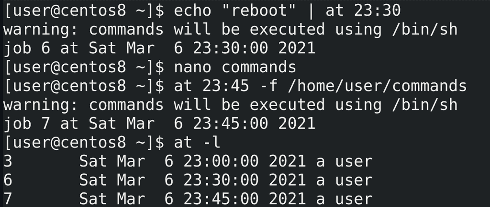

Как вы заметили, at ждал ввода из stdin. А значит мы можем  передать ему команды через пайп:

```
echo "reboot" | at 23:00
```

Либо можем указать файл с командами с помощью ключа -f:

```
at 23:45 -f /home/user/commands
```

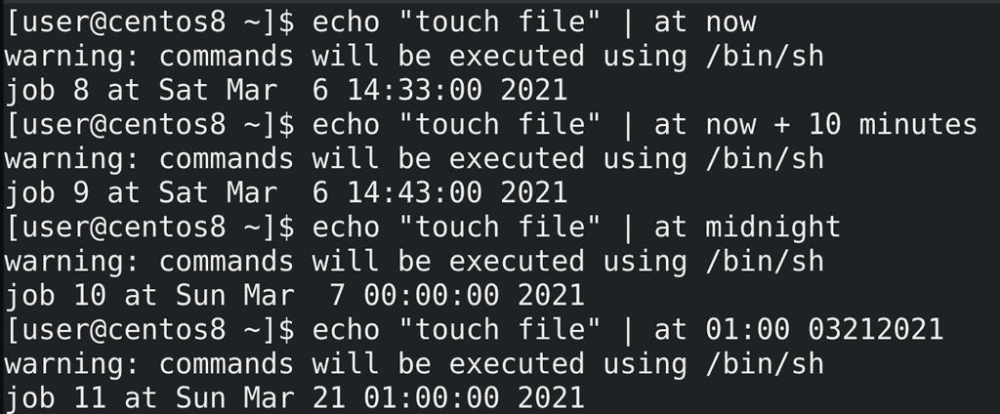

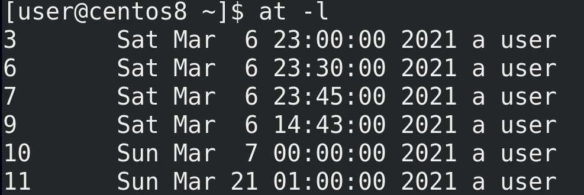

Касательно времени у at всё довольно гибко - можно настроить практически любое время. Например:

- at now - выполнит сейчас. Хороший вариант, чтобы протестировать работу.
- at now + 10 minutes - через 10 минут
- at midnight - ночью
- at 01:00 03212021 - 21 марта в час ночи

Есть множество других способов указать время, я показал основное, а более подробно вы можете сами найти в документации и в интернете.

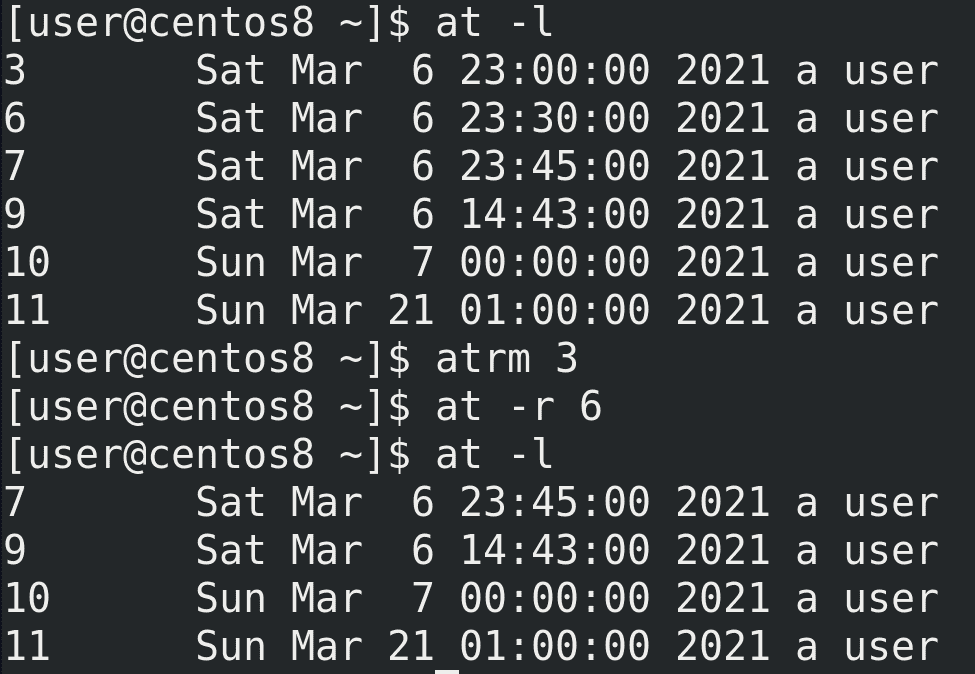

Для удаления какой-то задачи можно использовать atrm или at -r:

```
atrm 3
at -r 6
```


В документации к at также указана команда batch. Она может пригодится на серверах, когда вы хотите запустить какую-то программу, но сервер слишком нагружен. Если вы выполните команду сейчас, то это скажется на производительности. И тут вам в помощь приходит batch - работает она примерно как at, но без указания времени. Она следит за средней нагрузкой сервера - load average - и когда нагрузка упадёт меньше указанного лимита, по умолчанию это 0.8 - uptime, то batch выполнит указанную вами команду. Лимит можно настроить в файле /etc/sysconfig/atd.


Кстати, atd - это демон, который стоит за работой at:

```
systemctl status atd
```

И после изменения настроек в /etc/sysconfig/atd стоит рестартнуть этот сервис. Кстати, сам at может посылать письмо пользователю после выполнения задачи. Но это отдельная тема.


Можно разрешить или запретить пользователям использовать команду at и batch, для этого нужно указать пользователей в соответствующих файлах - /etc/at.allow или /etc/at.deny:

```
man at.allow
```

По умолчанию существует пустой файл /etc/at.deny - это говорит о том, что всем пользователям разрешено использовать at. Если создать at.allow, то только пользователи, указанные в этом файле, будут иметь возможность использовать at. Если этих файлов нет, то только root может использовать at.


at позволяет выполнять команду в указанное время,  что удобно для разовых задач. Но автоматизация зачастую предполагает регулярное выполнение одних и тех же задач. Для таких целей используется другая утилита - cron:

```
systemctl status crond
```

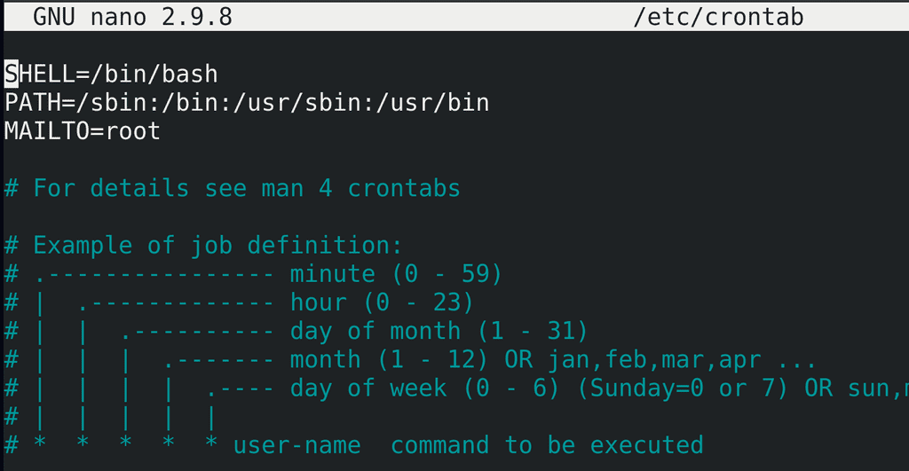

Для начала определимся с настройками и посмотрим примеры. Основной файл настроек - /etc/crontab:

```
nano /etc/crontab
```

Тут мы видим оболочку, в которой будут выполняться наши команды, переменную PATH и MAILTO - кому будут отправляться письма о выполнении. Этот файл относится к пользователю root, поэтому он и указан в качестве адресата писем. Но как и в at, в cron у каждого пользователя могут быть свои задачи и, соответственно, своя переменная MAILTO.

Ниже у нас пример настройки задачи. Время можно задать с помощью 5 значений - минуты, часы, день месяца, сам месяц и день недели. Если нам нужно выполнять задачу каждый день, то в качестве значения дня месяца оставляем звёздочку. Каждый месяц? Оставляем звёздочку. Каждый день недели? Звёздочку. Так со всеми значениями. После задания времени нужно указать команду. У пользователя root есть дополнительная возможность указать от чьего имени будет запускаться команда.


Чтобы настроить список задач cron для моего пользователя, я от своего имени запускаю команду:

```
crontab -e
```

e - это edit. Запускается текстовой редактор по умолчанию, т.е. vim. Чтобы открывать crontab в другом редакторе, надо выдать значение переменной EDITOR:

```
echo "export EDITOR=nano" >> ~/.bashrc
```

и открыть новую сессию bash:

```
bash
```

После чего crontab откроется в nano:

```
crontab -e
```


Предположим, мне нужно выполнять команду backup в каждое воскресенье. Для этого мне нужно определиться со временем - во сколько часов и минут. Допустим в 23:30. Тогда в качестве минут выставляю 30, в качестве часов - 23. День месяца нас не интересует, потому что бэкап у нас по воскресеньям, а это может быть любым днём, поэтому ставим звёздочку. Также нас не интересует конкретный месяц, у нас бэкап должен идти каждый месяц, поэтому также звёздочку. Остаётся указать день недели - воскресенье. По определённым причинам в некоторых странах, в том числе в США, первым днём недели принято считать воскресенье. В стандарте cron значения недели могут варьироваться от 0 до 6, то есть 0 - это воскресенье, поэтому пишем 0. Хотя в Centos можно указать и 7, но суть в том, что демон cron существует во многих unix-подобных системах и он может немного отличаться. От 0 до 6 это стандарт, который будет работать везде. После чего указываем, какую именно команду выполнять - /usr/bin/backup:

```
30 23 * * 7 /usr/bin/backup
```

Сохраняем и закрываем файл. Список задач можно посмотреть с помощью ключа -l:

```
crontab -l
```

Если бы я указал в качестве минут и часов звёздочку, то команда backup запускалась бы каждую минуту каждого часа воскресенья.

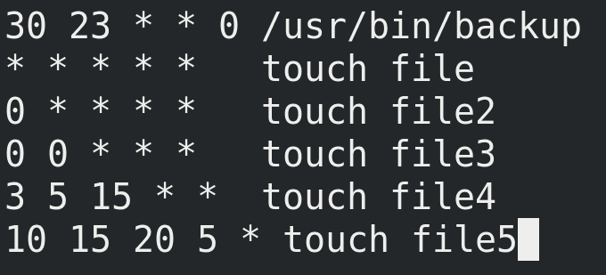

Давайте рассмотрим пару примеров:


``` * * * * * touch file ``` - каждую минуту выполнять команду touch file.

``` 0 * * * * touch file2 ``` - раз в каждый час, в нулевую минуту, выполнять команду touch file2.

``` 0 0 * * * touch file3 ``` - раз в день, в 00:00, выполнять команду touch file3.

``` 3 5 15 * * touch file4 ``` - каждого 15 числа любого месяца в 5:03 выполнять команду touch file4.

``` 10 15 20 5 * touch file5 ``` - каждого 20 мая в 15:10 выполнять команду touch file5.


Также можно использовать несколько значений, диапазоны или шаги. Например:

``` */5 * * * * touch file6 ``` - раз в 5 минут

``` 0 9,18 * * * touch file7 ``` - в 9:00 и 18:00

``` 0 0 * * 1-5 touch file8 ``` - каждую полночь с понедельника по пятницу


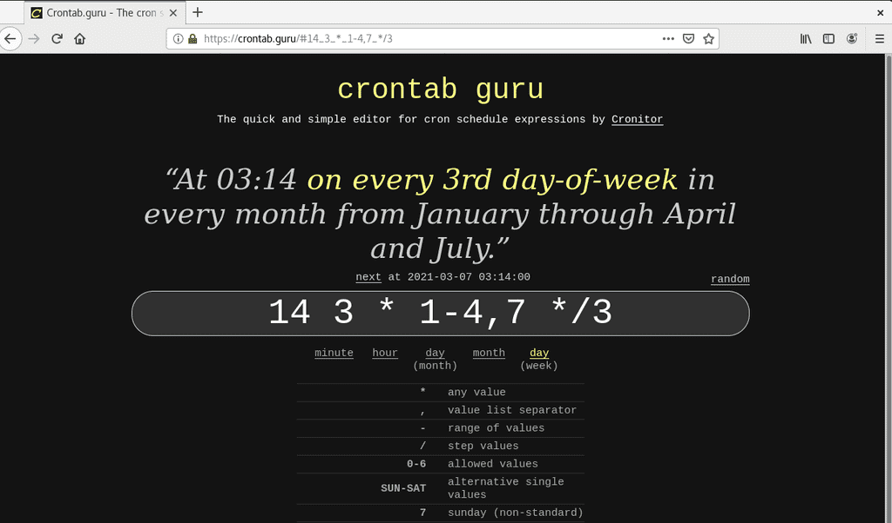

Это очень гибкая система времени и по началу вы можете сомневаться, правильно ли вы задали время. В таких случаях вы можете воспользоваться сайтом [crontab.guru](https://crontab.guru/). Просто напишите здесь предполагаемое время и он распишет это время английским языком.


В /etc/ есть несколько директорий для cron:

```
ls /etc/cron.*
```

cron.hourly, cron.daily, cron.weekly и cron.monthly. Когда у вас есть скрипт, который нужно выполнять регулярно, при этом не важно, в какую именно минуту, вы можете закинуть такой скрипт в соответствующую директорию. Для примера, так работает logrotate:

```
cat /etc/cron.daily/logrotate
```

у него нет своего демона, его раз в день запускает cron. Из этого следует вывод - если вы хотите ротировать логи по размеру, а не по дням, то имеет смысл переместить этот скрипт из cron.daily в cron.hourly.

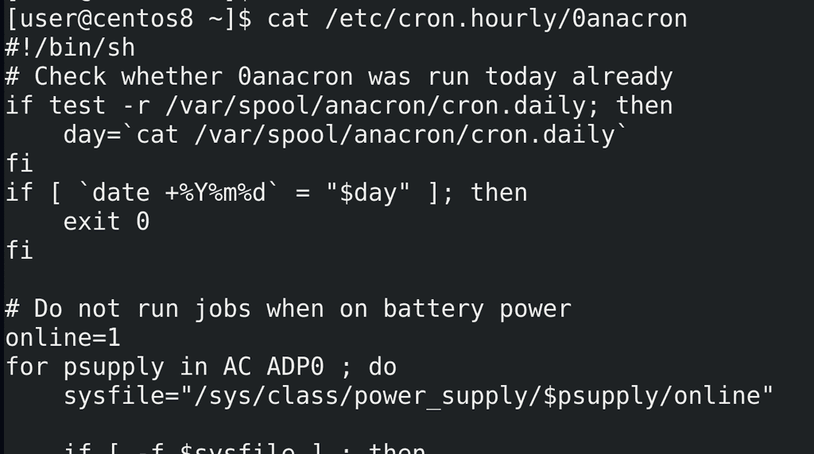

Ещё один интересный файл - /etc/cron.hourly/0anacron:

```
cat /etc/cron.hourly/0anacron
```

Есть такая программа - anacron, которая также позволяет планировать задачи. В чём разница: представьте, что в cron-е написано сделать бэкап в полночь. Но почему-то в это время компьютер был выключен, соответственно, cron не сработал. Тогда cron просто пропустит задачу и выполнит в следующий раз, по графику. Т.е. cron обычно жёстко привязан к времени, что имеет смысл на серверах, где не стоит делать задачи, тот же бэкап, в рабочее время. Но на пользовательских компьютерах, если я вечером выключил компьютер, а утром включил, то дожидаться следующей полночи для бэкапа не очень хорошая идея, лучше сделать его после включения. Для этого лучше подходит anacron - он работает с периодами времени. И если, скажем, вы в anacron настроите бэкап раз в день, то, если компьютер будет выключен в запланированное для бэкапа время, бэкап будет сделать после включения.

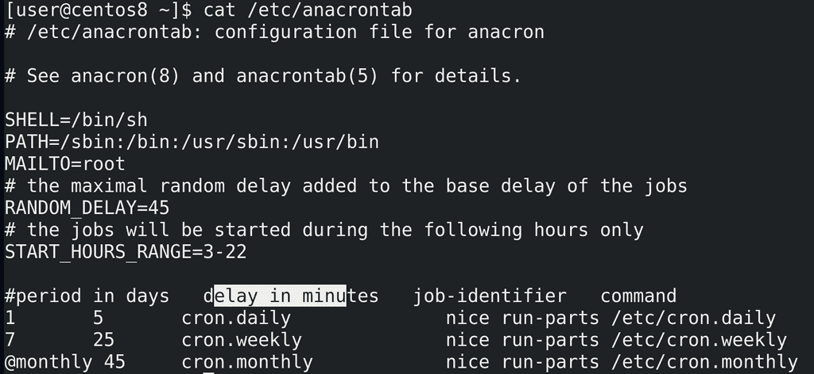

Настройки anacron лежат в файле /etc/anacrontab:

```
cat /etc/anacrontab
```

Помните директории /etc/cron.daily, weekly и monthly, где лежат скрипты? Раньше их выполнял сам cron, но сейчас этим занимается anacron. И это видно по последним строчкам. Тут у нас вместо конкретики по времени - периоды: раз в день, в неделю и в месяц.

Следующий столбик - время отсрочки. Допустим, cron.daily выполняется раз в день, но не сразу при достижении времени, а минут через 5. Причём,  переменная RANDOM\_DELAY добавляет к эти 5 минутам рандомное количество минут, максимум 45. Для чего это нужно? Например, когда у вас в сети много компьютеров и все они в одно и тоже время начинают делать бэкап, это начинает грузить сеть. А рандом позволяет компьютерам немного распределить это время, чтобы все разом не грузили сеть. Ещё одна переменная - START\_HOURS_RANGE - говорит о том, что эти задачи будут запускаться только в промежуток между 3:00 и 22:00. Естественно, все эти переменные можно изменить под свои задачи.

После отсрочки указывается идентификатор задачи (job-identifier), по которому можно будет найти задачу в логах. А в конце - команда. Можно добавить какую-то свою задачу сюда, со своей периодичностью, либо закинуть скрипты в указанные директории.

Мы с вами разобрали at, cron и anacron, которые позволяют нам запланировать задачи и выполнять их. Администратору очень важно видеть список запланированных задач, это позволяет контролировать происходящее на сервере, да и всякий вирусняк любит себя записывать в планировщики. У некоторых пользователей может быть свой crontab, at и в редких случаях anacron. А пользовательские задачи не лежат в директории /etc/, поэтому их оттуда не отследить.

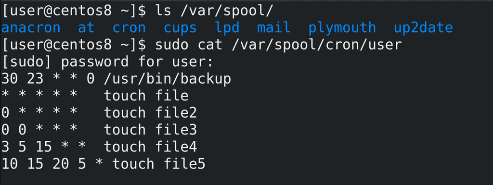

Для таких задач есть директория /var/spool:

```
ls /var/spool
```

И у at, и у cron тут есть свои директории. Если посмотреть содержимое этих директорий, можно понять, какие задачи запланированы у пользователей.


Также стоит поговорить про таймеры systemd. В systemd встроен функционал планировщика задач, который выполнен в виде unit-ов. Помните, мы говорили, что в systemd функционал реализован в виде unit-ов - сервисы это юниты, группы сервисов - таргеты - тоже юниты, устройства - юниты, монтируемые файловые системы - тоже юниты. Так вот, есть ещё один тип юнитов - таймеры:

```
systemctl list-timers
```

Эти таймеры можно связать с сервисами, что позволит вам гибко настроить время работы сервиса. Кроме существующих сервисов, вы можете использовать таймеры как замену cron-у и at, чтобы унифицировать управление регулярными задачами через systemd. Обычно таймер надо создавать вручную, что не сложно, но больше относится к теме создания unit-ов systemd. А я не хочу мешать темы, поэтому когда-нибудь мы эту тему детальнее разберём, но если вам интересно, почитайте по [ссылке](https://habr.com/ru/company/ruvds/blog/512868/).

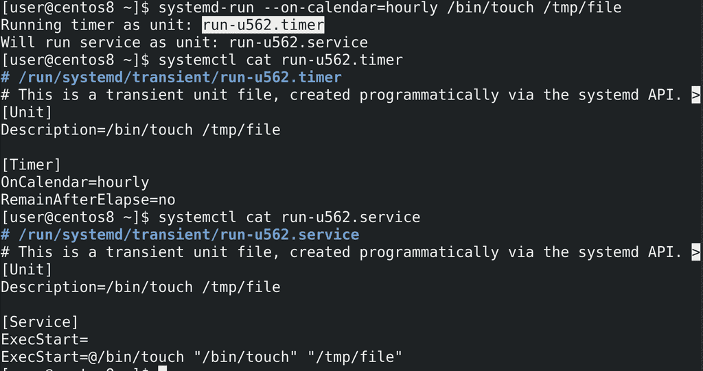

Есть простой способ создать таймеры, хотя и временные:

```
systemd-run --on-calendar=hourly /bin/touch /tmp/file
systemctl cat run-u562.timer
systemctl cat run-u562.service
```

При этом создаётся и таймер, и сервис, но это всё существует, пока не выполнится временное условие, либо пока не перезагрузится сервер. Простой пример - таймер, который раз в час запускает touch file. Но, опять же, это временный таймер, постоянные таймеры надо создавать по другому.

Подводя итоги, мы с вами разобрали несколько планировщиков задач - at, cron, anacron и таймеры systemd, которые одновременно работают на наших системах, у каждого свои возможности, где-то они пересекаются, где-то уникальны. Так или иначе они упрощают работу системному администратору, поэтому стоит научиться ими пользоваться.
