# 45. Принудительный контроль доступа - SElinux

<iframe width='560' height='315' src="https://www.youtube.com/embed/IPeZPbxYO2I" title='YouTube video player' frameborder='0' allow='accelerometer; autoplay; clipboard-write; encrypted-media; gyroscope; picture-in-picture' allowfullscreen></iframe>

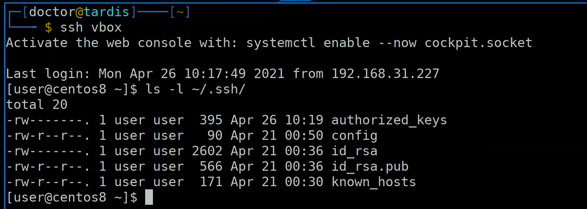

В прошлый раз мы с вами разобрали SSH и затронули тему пользовательских ключей. Мы можем сгенерировать два ключа - приватный и публичный. После чего закинуть публичный ключ на все свои сервера и подключаться к ним без пароля, используя приватный ключ. Это говорит о том, что приватный ключ нужно беречь, как зеницу ока. Давайте глянем права этого файла - ls -l ~/.ssh. По ним видно, что к файлу есть доступ только у владельца файла, остальные не могут его прочесть. Вроде бы всё нормально, никакой другой пользователь не сможет украсть этот файл.

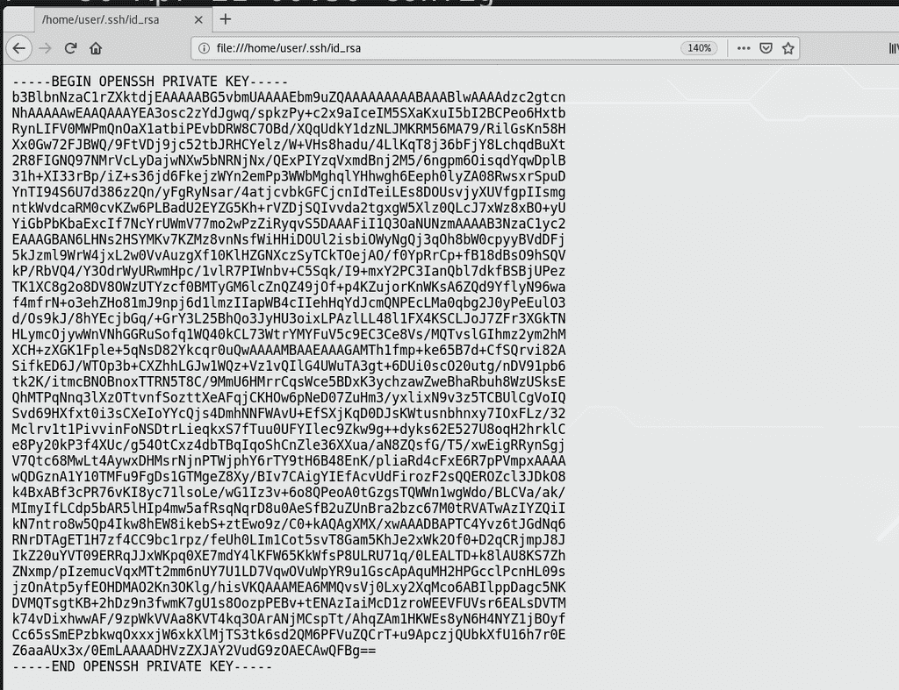

А давайте подумаем, что означают права? То, что у процесса, запущенного от имени этого пользователя, будет доступ к этому файлу. И если я запускаю ssh клиент от моего пользователя, то он сможет прочесть этот файл, а если кто-то другой запустит ssh - то это будет процесс от другого пользователя и у него не будет прав к этому файлу. Но что, если я запущу не ssh клиент, а другую программу? Например, firefox. И через firefox попытаюсь прочесть этот файл. С точки зрения стандартных прав всё нормально - это процесс, запущенный от моего пользователя и у него есть доступ ко всем моим файлам. И в обычной ситуации firefox-у не нужны мои ssh ключи. А если он заражён? Что, если я установил какой-то плагин для firefox-а, а он оказался зловредом? Получится, что firefox сможет делать с моими файлами всё что угодно, например, украсть мои ssh ключи. По хорошему, у firefox в принципе не должно быть прав к моим ключам. Но, с точки зрения прав, всё нормально.

А это значит, что стандартных прав недостаточно. У нас есть процессы и файлы, которые могут взаимодействовать с точки зрения прав,  но нужно как-то оградить их. И для этого есть системы принудительного доступа. В самом ядре Linux есть фреймворк LSM - что-то типа каркаса, который можно использовать для разработки программ для безопасности. АНБ и RedHat на основе этого каркаса сделали SElinux, который используется многими дистрибутивами на основе RHEL, а на Ubuntu-based дистрибутивах используется AppArmor.

Очень грубо говоря, в SElinux прописаны политики, какой программе что разрешено. Если что-то не прописано - он блокирует это. Политики прописаны на стандартные настройки, а администраторы в программах зачастую меняют эти стандартные настройки. Допустим, мы говорили, что по умолчанию ssh сервер работает на 22 порту, но, если сервер доступен в интернете, стоит изменить стандартный порт. Так вот, если изменить стандартный порт в SSH, SElinux запретит ssh серверу работать на нестандартном порту и демон просто не сможет запуститься. Чтобы он заработал, надо поменять политику в SElinux. И так со многими программами.

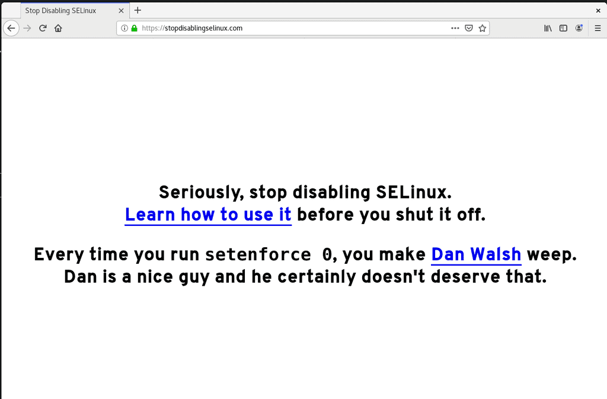

Это отпугивает некоторых администраторов, так как нередко они просто копипастят конфиги и команды из интернета, не вникая в то, что там написано. И тут SElinux блокирует демон из-за нестандартных настроек. Администраторы не понимают почему, не знают как решить и ищут одну простую команду - чтобы всё работало. И зачастую эта команда - отключить SElinux. Но отключать безопасность в угоду лени - плохая затея, даже есть специальный [сайт](https://stopdisablingselinux.com/), который просит так не делать.

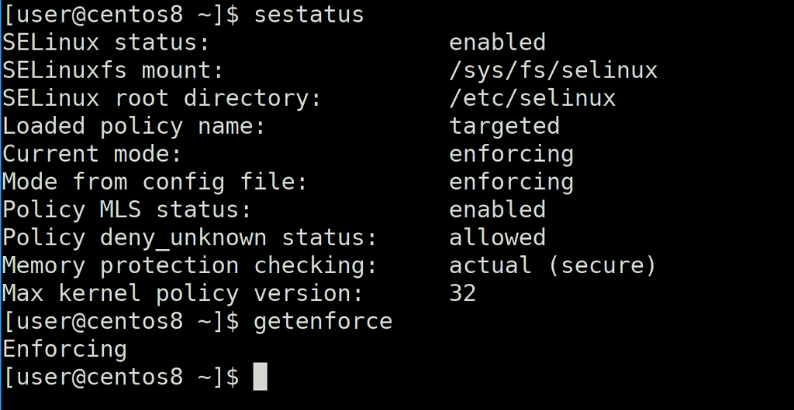

И так, SELinux можно отключать, но не только. В целом у него 3 режима - disabled, permissive и enforcing. Текущий статус можно посмотреть с помощью команды sestatus или getenforce. По умолчанию - enforcing - политики работают, всё что не разрешено политиками - блокируется. В режиме permissive ничего не блокируется, но SElinux всё нестандартное логирует. А в режиме disabled он просто отключён.

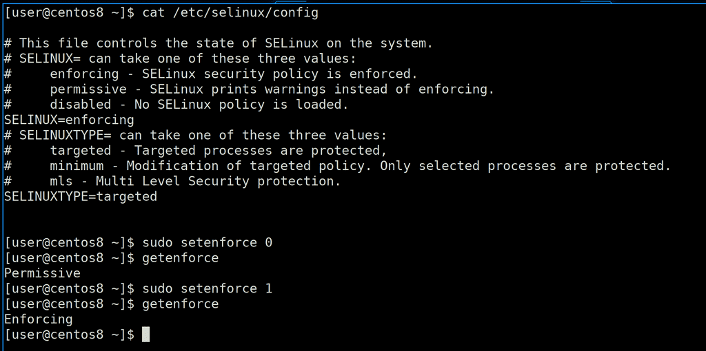

Режимы можно поменять в файле /etc/selinux/config, изменив значение переменной SELINUX. Но это изменение вступит в силу только после перезагрузки, а чтобы сейчас временно его отключить достаточно прописать setenforce 0 - sudo setenforce 0; getenforce, что переведёт SElinux в режим permissive. Чтобы заново перевести в enforcing - setenforce 1 - sudo setenforce 1; getenforce.

Выключать SElinux не рекомендую, лучше научиться его настраивать. Но иногда в работе встречается софт, в требованиях которого указано - не работает с SElinux. На самом деле, в большинстве случаев можно проигнорировать это требование и настроить его должным образом. Но если в дальнейшем возникнут проблемы и техническая поддержка софта увидит включённый SElinux - начнёт все проблемы валить на него. Поэтому нужно уметь его выключать, но не стоит это делать просто так. Если всё же нельзя использовать SElinux - используйте режим permissive - логи могут быть полезны.

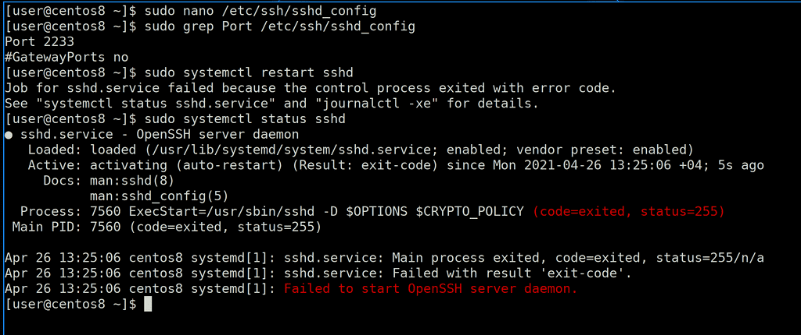

О деталях работы SElinux поговорим чуть позже, сейчас для понимания нужен пример. Тот же самый SSH с нестандартным портом. Зайдём в конфиг - sudo nano /etc/ssh/sshd_config - раскомментируем Port и поменяем значение на другое - Port=2233; sudo grep Port /etc/ssh/sshd_config. Чтобы изменения вступили в силу, нужно перезапустить демон - sudo systemctl restart sshd. Но после команды мы видим ошибку. Если рестарт демона заканчивается ошибкой - значит он перестаёт работать, можем проверить статус - sudo systemctl status sshd. Как видите, статус сервиса - activating - это означает, что он пытается запуститься, но не может. Кстати, обратите внимание, что даже при перезапуске SSH сервера и его неработоспособности, я всё ещё подключён по SSH. На самом деле, это скорее исключение из правил, так как большинство других демонов при рестарте сбрасывает соединения. Но SSH так не делает, чтобы администратор не потерял доступ к серверу, так как вернуть доступ может быть довольно сложной задачей.

Первое, что нужно сделать, если сервис не запустился - посмотреть логи - sudo journalctl -eu sshd. В большинстве случаев здесь можно найти причину, но в случае с SElinux - в логах демона об этом ни слова. Большинство демонов не в курсе о SElinux и не знают, что их блокирует.

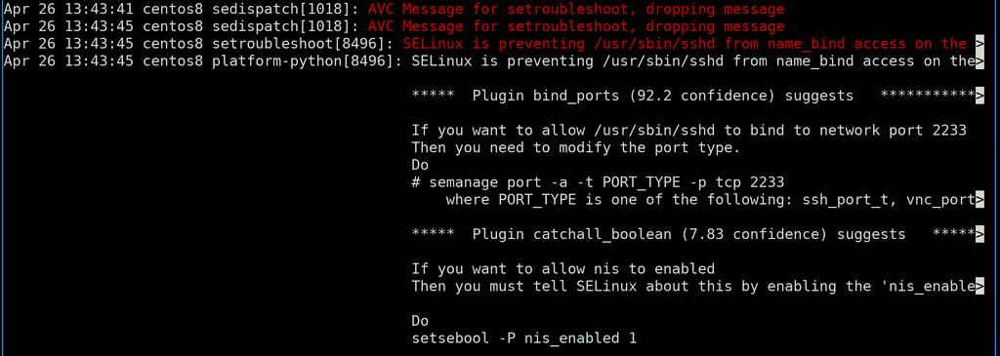

Однако сам SElinux также посылает логи, которые можно увидеть в числе последних  - sudo journalctl -e. Они сразу выделяются среди остальных логов - здесь и причина блокировки, и подсказка, как решить эту проблему. Здесь мы видим, что SElinux блокирует приложению /usr/bin/sshd использование порта 2233. И тут же подсказка - если вы хотите разрешить, запустите команду - semanage port -a -t тип порта -p tcp 2233. В типах порта может быть ssh_port_t, vnc_port_t и т.д., но интуитивно понятно, что речь про ssh_port_t.

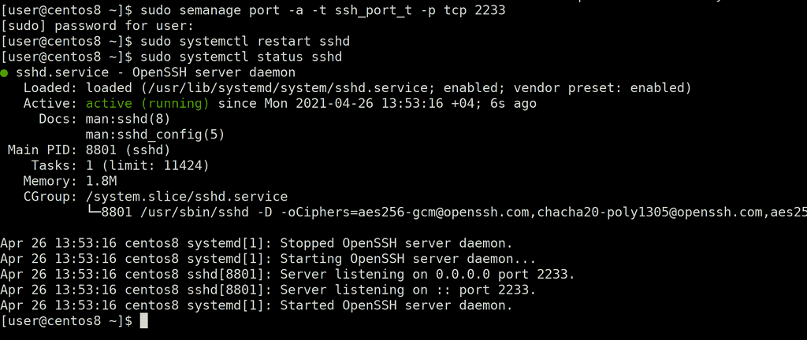

Попробуем запустить команду - sudo semanage port -a -t ssh_port_t -p tcp 2233. После чего рестартнём сервис ssh и проверим его статус - sudo systemctl restart sshd; sudo systemctl status sshd. Перезапустилось без ошибок и всё работает - внизу видно, что ssh теперь работает на порту 2233.

Это было просто - мы посмотрели последние логи, где SElinux подсказал нам нужную команду, мы её запустили - и всё работает. И в самих настройках SSH, над строчкой смены порта, также указывалась эта команда. Но, справедливости ради, не всегда так просто. В конфигах каких-то часто используемых демонов над часто изменяемыми опциями бывают подсказки, в логах также указываются такие подсказки. Но где-то может не быть подсказок, где-то подсказки могут быть неточными - поэтому нужно немного разобраться в самом SElinux и его командах. Прежде чем продолжим, вернём в конфигах SSH порт 22, так как по 2233 порту мы не сможем подключиться из-за фаервола. После чего рестартнём сервис.

И так, до этого я говорил о том, что SElinux может блокировать доступ к файлу, на примере приватного ключа SSH, а потом показал пример с tcp портом. Также его можно использовать для ограничения доступа к оборудованию, но, в отличии от файлов и сетевых портов, это настраивается реже. Как это работает? Для примера возьмём блокировку доступа к файлу.

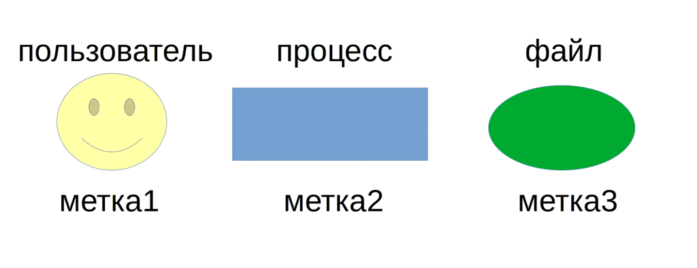

Всю работу операционной системы в очень простом виде можно представить так - какой-то пользователь запустил какую-то программу, которая стала процессом, и этот процесс обращается к каким-то файлам. Пользователь, процесс и файл - 3 основных компонента, которым SElinux ставит метки. Эти метки называются контекстами. И SElinux позволяет написать правила, по которому, например, процесс с меткой 2 может читать файл с меткой 3. Когда какой-то процесс пытается открыть файл, сначала система проверяет на стандартные права - группу, владельца, остальных, а также rwx. Если стандартные права говорят, что всё ок, что у процесса есть доступ к файлу, SElinux делает свою проверку - а есть ли у метки 2 доступ к метке 3? И если такого правила нет, то SElinux запрещает это действие и процесс не может открыть файл.

В программы, которые показывают информацию о пользователях, процессах и файлах, для работы с SElinux добавили ключ -Z. Давайте посмотрим контекст нашего пользователя, какого-нибудь процесса и файла - id -Z; ps -Z; ls -Z file. Вот этот страшный набор символов - это и есть контекст. Но пусть вас это не пугает, потому что всё довольно просто.

Обратите внимание, что контекст состоит из нескольких значений, разделённых двоеточием. И в конце каждого значения есть нижнее подчёркивание и определённая буква. u - это юзер, r - это роль, t - это тип.

Начнём с юзера. SElinux не использует системных пользователей, а имеет своих, но при этом их связывает. Это можно увидеть с помощью команды semanage login с ключом -l - sudo semanage login -l. В первом столбце - локальные пользователи - _default_ подходит под всех пользователей, root только под рута. Во втором столбце - к какому пользователю SElinux они привязаны - в данном случае и рут, и все остальные наши пользователи привязаны к пользователю unconfined. Т.е. к одному пользователю SElinux привязаны несколько локальных пользователей. Этот пользователь используется, если никаких ограничений по пользователю мы не хотим. Т.е. в нашей системе SElinux никак не ограничивает по пользовательским меткам.

Однако, для максимальной безопасности, если у вас много пользователей в системе, можно настроить SElinux так, чтобы определённые пользователи могли делать только что-то определённое. Например, создать политику, чтобы пользователь не мог запускать sudo. Есть несколько дефолтных пользователей SElinux с прописанными правилами, но, так как в большинстве случаев это только усложнит работу администратору, по умолчанию, у нас не такой жёсткий режим. Т.е. хоть мы и сказали, что в контексте указан юзер, в нашей системе это ничего не значит, у нас нет блокировок по пользовательским меткам.

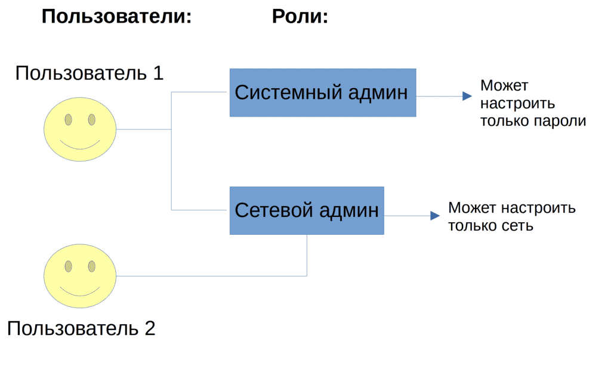

Но представьте, что ограничения мы будем прописывать по пользователям. Например, пользователю 2 можно настроить только сеть. А если у нас несколько пользователей, которым нужны различные разрешения? Кому-то надо разрешить сеть настраивать, кому-то sudo делать и т.п. Получится, что для каждого пользователя надо отдельные политики писать. А это очень неудобно. Поэтому правила обычно пишутся не на пользователей, а на роли. И у одного пользователя могут быть несколько ролей. Т.е., допустим, у пользователя 2 роль только "сетевой админ", и всё что он может - настроить сеть. А пользователь 1 должен и сеть настроить и пароли задать. Поэтому ему мы даём две роли.

В итоге у нас получается, что несколько обычных пользователей привязываются к одному SElinux пользователю, а у него может быть несколько ролей.

Чтобы посмотреть, у какого пользователя какие роли, можно выполнить команду semanage user с ключом -l - sudo semanage user -l. Тут видно, что у некоторых пользователей одна роль, а у некоторых несколько.

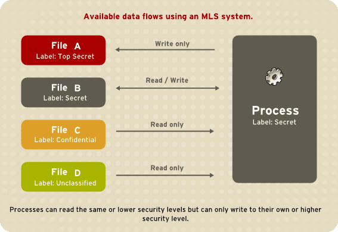

И раз уж у нас перед глазами маячит MLS, давайте его тоже упомянем. MLS - многоуровневая безопасность. Это не совсем часть принудительного контроля доступа, скорее отдельный механизм, но тесно связанный с этой темой. Вкратце, MLS позволяет настроить безопасность по уровням. Скажем, у нас есть процесс, у которого определённый уровень. Файлы с уровнями ниже он может читать, файл с тем же уровнем он может читать и изменять, а файл с уровнем выше он может только изменять, не имея доступ для чтения. Но MLS по умолчанию выключен, мы видим его метки, но сейчас никаких ограничений по ним нет.

После роли у нас идёт тип. Если юзер и роль у нас сейчас никак не воздействуют на систему, то именно тип накладывает ограничения. Помните пример в начале, где какой-то процесс не мог открыть файл, потому что метка не позволяла? Так вот, всё дело в типе. У процесса 1 есть свой тип, у файла - свой тип. SElinux проверяет правила, а может ли тип 1 открывать тип 2? Правда типы, относящиеся к процессам, принято называть доменами, а у файлов типы это типы. Т.е. может ли домен 1 открыть тип 2?

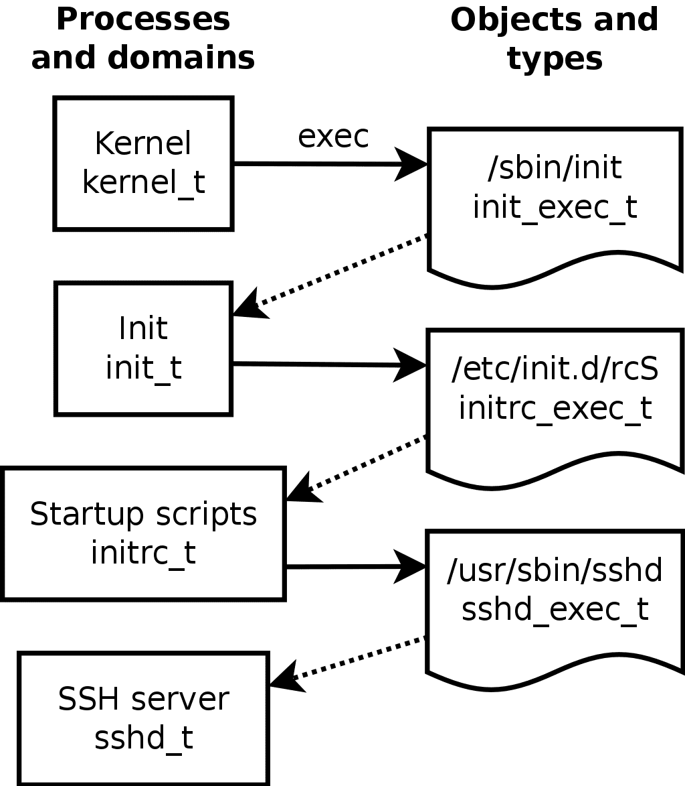

Иногда один домен может переходить в другой, например, когда одна программа запускает другую. И это также задаётся в правилах SElinux. Т.е., если одна программа попытается запустить другую, то SElinux проверит, есть ли у программы с доменом 1 право на запуск программы с доменом 2?

И так, принцип работы SElinux-а надеюсь понятен: у каждого пользователя, процесса и файла есть контекст, состоящий из юзера, роли и типа. Юзер и роль определяют разрешения по пользователям, но по умолчанию это вырублено. А типы - если он относится к процессу, то это домен, если к файлу - то это тип - определяют, у каких процессов к каким файлам, другим процессам, портам и устройствам есть доступ, и какой именно. Есть ещё MSL, но он по умолчанию выключен и не совсем по теме.

Давайте попытаемся проанализировать, что мы сделали с SSH, когда меняли порт - sudo semanage port -a -t ssh_port_t -p tcp 2233. Сразу виден тип - ssh_port_t. Если посмотреть значение опции -a для semanage-port станет ясно, что мы для этого типа добавили запись. Т.е. теперь ssh_port_t имеет доступ не только к 22 порту, но и к 2233. Это можно увидеть, если посмотреть список всех разрешений по портам - sudo semanage port -l | grep ssh_port_t.

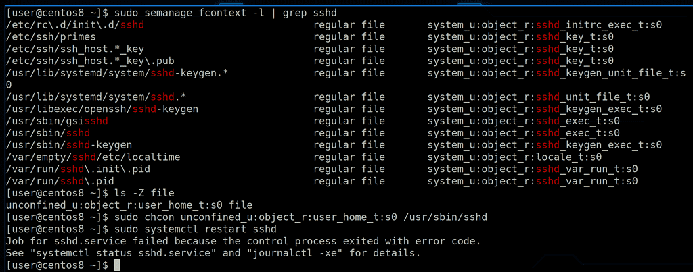

Ладно, с портами разобрались, что насчёт файлов? За них у нас отвечает semanage fcontext. Например, поищем, какие должны быть контексты у файлов sshd - sudo semanage  fcontext -l | grep sshd. Тут есть разные файлы, давайте испортим метку одного из файлов, например, /usr/sbin/sshd. Возьмём контекст любого файла - ls -Z file - и скопируем. Для смены используем утилиту chcon - sudo chconf ... /usr/bin/sshd. После этого попытаемся рестартнуть сервис - sudo systemctl restart sshd. Как видите, ssh отказывается запускаться.

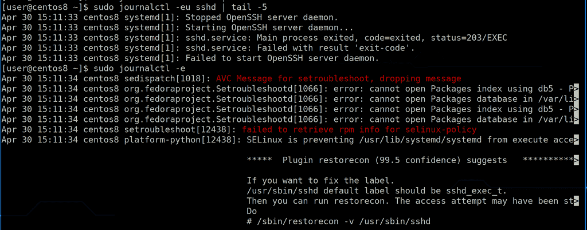

Посмотрим логи sshd - sudo journalctl -eu sshd. Тут ни слова о причине проблемы. Поэтому просто проверим последние логи - sudo journalctl -e. И тут сразу видим подсказку - SElinux запрещает systemd запустить sshd. Скорее всего нет политики, которая бы разрешала домену systemd запускать домен со скопированном типом user_home_t.

Вернём контекст обратно, для этого есть утилита restorecon - sudo restorecon -v /usr/sbin/sshd. Она восстанавливает заданный по умолчанию контекст файла. После этого рестарт сервиса прошёл успешно - sudo systemctl restart sshd.

Так вот, иногда, по определённым причинам, система может восстановить контекст всех файлов в системе. Это можно сделать и вручную, создав пустой файл /.autorelabel в корне и перезагрузившись. Этот процесс занимает определённое время и попросту запускать его не стоит, чтобы случайно ничего не сломать. Поэтому chcon можно использовать как временное решение, иначе случайное восстановление опять всё сломает. И вместо chcon рекомендуется использовать знакомый semanage fcontext.

Например, укажем в политике, чтобы у файла был контекст, как у sshd - ls -1Z file /usr/sbin/sshd; sudo semanage fcontext -at sshd_exec_t /home/user/file. Обратите внимание, что нужно использовать полный путь к файлу. Если проверить после выполнения команды - ls -Z file - казалось бы, ничего не изменилось. Но на самом деле fcontext меняет значение в политике, а не сразу в файле. Поэтому достаточно просто восстановить контекст по умолчанию - sudo restorecon -v file - и мы увидим, что тип контекста сменился на sshd_exec_t. Также сможем найти наш файл в политиках - sudo semanage fcontext -l | grep /home/user/file.

Смена контекста файлов и директорий часто бывает нужна, когда вы меняете стандартные настройки демона. По умолчанию у демона есть право работать с определёнными файлами/директориями, а вам бывает нужно настроить директорию в нестандартном месте. Вы меняете директорию в настройках, а сервис отказывается перезапускаться, потому что не может прочесть файлы, так как контекст не соответствует политике. И для этого есть определённое выражение, рассмотрим на примере Documents - sudo semanage fcontext -at sshd_exec_t "/home/user/Documents(/.*)?". Это меняет контекст в политиках ко всем файлам и поддиректориям. И в конце не забываем восстановить контекст - sudo restorecon -rv /home/user/Documents. Тут уже restorecon с ключом -r - рекурсивно.

Иногда бывает, что в рамках безопасности контекст не очень подходит или очень сложно переделать контекст файлов. Поэтому частично возможности SElinux вынесены в двоичные опции - типа разрешить что-то или запретить. Их можно увидеть с помощью semanage boolean или getsebool - например, есть возможность заблокировать плагинам мозиллы доступ к использованию gps - sudo semanage boolean -l | grep mozilla; sudo getsebool -a | grep mozilla_plugin_use_gps. Как видите, эта опция выключена. Её можно включить используя команду setsebool - sudo setsebool mozilla_plugin_use_gps on. В конце можно указать 0, 1 или on, off. И чтобы увидеть изменения используем getsebool - sudo getsebool -a | grep mozilla_plugin_use_gps.

Но setsebool применяет изменения только в текущей сессии. Чтобы сохранить это значение в политиках, следует использовать ключ -P - sudo setsebool -P mozilla_plugin_use_gps on; sudo semanage boolean -l | grep mozilla.

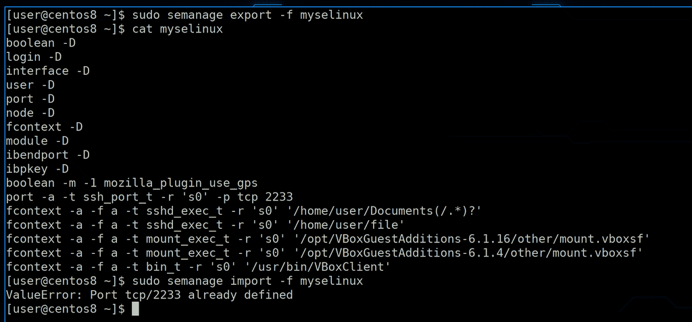

Ну и напоследок, мы можем все наши изменения вытащить в виде файла с помощью export - sudo semanage export -f myselinux; cat myselinux. Как видите, тут у нас и изменённый порт, и типы контекста и двоичная опция. Потом мы этот файл можем использовать как шаблон для быстрого применения на наших серверах.

Подведём итоги. Сегодня мы с вами разобрали SElinux - систему, которая играет важную роль в безопасности. Она даёт возможность детальной настройки принудительного контроля доступа. Конечно, мы разобрали только вершину айсберга - поняли, как она работает, как смотреть информацию и решать базовые проблемы. Но для основ этого вполне достаточно. Со временем мы не раз ещё столкнёмся с SElinux-ом и разберём больше примеров и возможностей.

И да, чуть не забыл. В начале я рассказывал про важность ssh ключей и про то, что Firefox не должен иметь к ним доступа. Но при этом спокойно нашёл и открыл ключи, и SElinux ничего не сделал. Просто применять политики от пользовательских программ к пользовательским файлам - невероятно сложно и многое легко сломать. Такие политики будут мешать пользователям и те будут постоянно выключать SElinux. Конечно, при максимальной безопасности это можно настроить, но в обыденной жизни между удобством и безопасностью должен быть компромисс.
