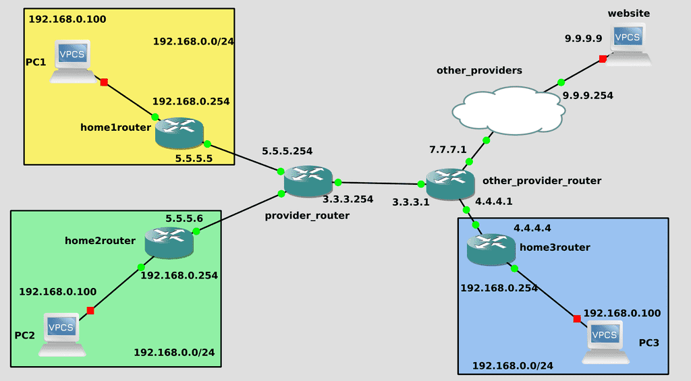
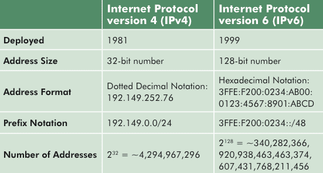
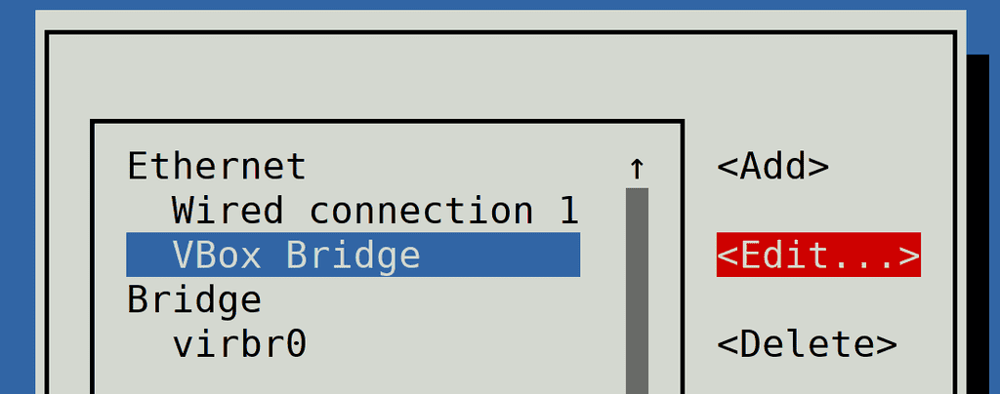
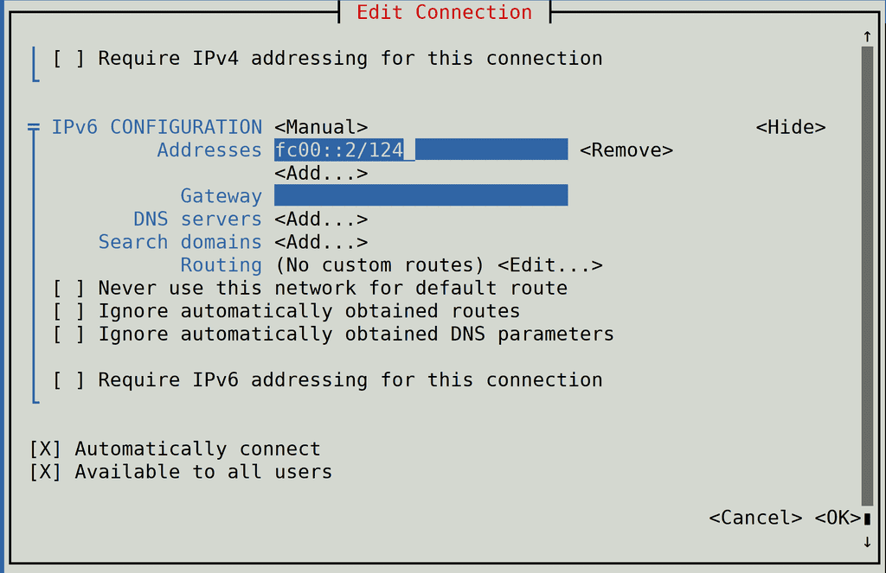
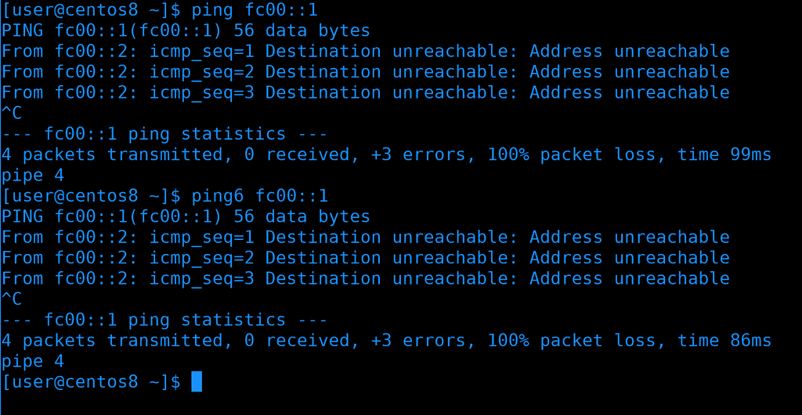
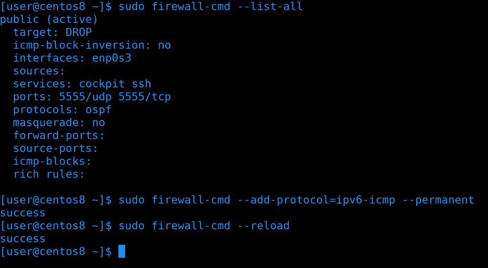
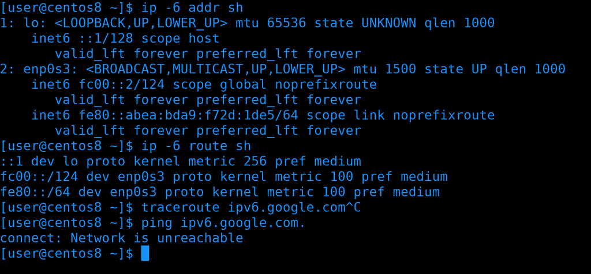
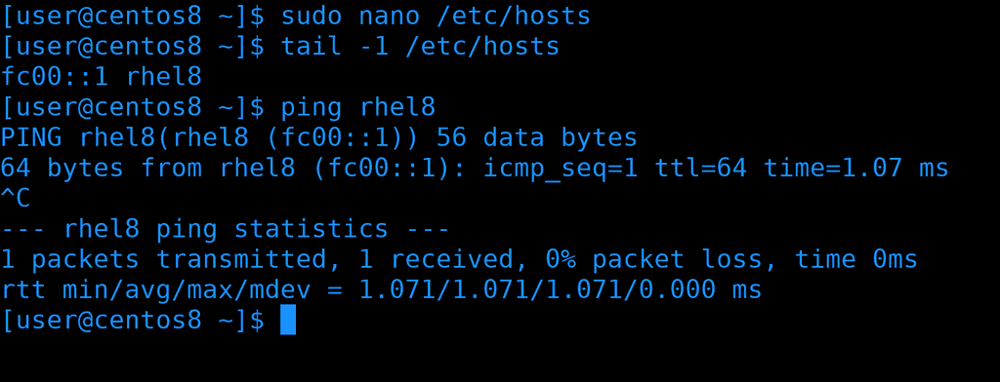
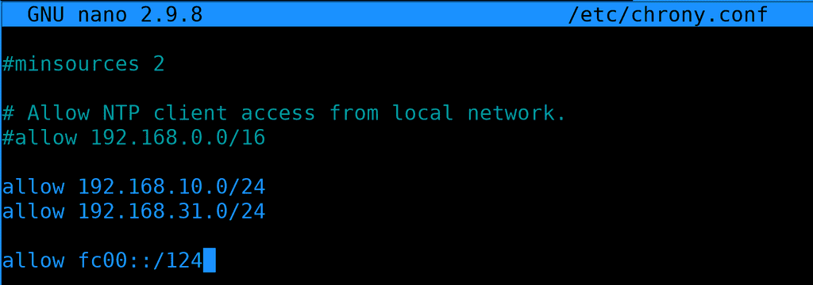

# 55. Работа с IPv6

<iframe width='560' height='315' src="https://www.youtube.com/embed/gkk7i68xPO4" title='YouTube video player' frameborder='0' allow='accelerometer; autoplay; clipboard-write; encrypted-media; gyroscope; picture-in-picture' allowfullscreen></iframe>


Когда-то давно мы посылали бумажные письма через почту в конвертах. И на этих конвертах были поля "откуда" и "куда", где приходилось очень мелким шрифтом писать длинный адрес, потому что Земля большая и нужно указывать страну, город, улицу, номер дома и номер квартиры. И если бы каждой стране, городу и улице дали бы какое-то численное значение, получилось бы, скажем, в 10 цифр уместить точный адрес человека. Когда создавали компьютерные сети, нужно было придумать универсальный конверт - т.е. протокол. Этот протокол называется IPv4. И под поля "Откуда" и "Куда" решили выделить по 32 бита, что примерно 4 миллиарда значений. Они не учли то, что у каждого человека будет по несколько устройств, каждому из которых нужен будет адрес, не говоря уже о виртуалках и прочем.      



Это ограничение в 4 миллиарда устройств давно пройдено, но сети всё ещё функционируют благодаря NAT-у. В большинстве домов и компаний, т.е. в локальных сетях адреса одинаковые, и сотни устройств одной компании выходят в глобальную сеть по одному публичному IP адресу. Хотя это и спасает, но накладывает определённые ограничения. Представьте, что в конверте из полей "Откуда" и "Куда" убрали адрес квартиры. И если вы пошлёте курьера доставить письмо в Гугл, то он будет помнить адрес вашей квартиры и сможет вернуться к вам. Но если Гугл сам решит вам что-то отправить - письмо максимум дойдёт до вахтёрши, т.е. до вашего роутера. А она не будет знать, кому конкретно доставить, потому что квартир много, поэтому просто выкинет письмо. С одной стороны это, конечно, хорошо - вахтёрша не будет пускать непрошенных гостей и из интернета ваш компьютер не будет доступен. Но что, если вы хотите этого? Если вам нужно, чтобы ваши устройства были доступны из интернета, скажем, вы захотели у себя поднять вебсайт. Пока что это можно сделать, арендовать у провайдера публичные адреса. Но это стоит денег, с каждым годом адресов остаётся все меньше, а устройств всё больше. Адресов на самом деле не осталось, но где-то компания закроется, где-то перестанут платить - и может освободятся пару адресов. Короче, дефицит.



Поэтому решили переделать конверт. Если раньше выделяли 32 бита на адрес, то теперь целых 128 бит. На сей раз адресов должно хватить надолго. Переход на новый протокол решил бы многие проблемы в сетях, но не всё так просто. Основная проблема - на это должны перейти все, так как нет обратной совместимости. Каждый провайдер должен у себя ввести поддержку IPv6, обновить оборудование, донастроить - а это затраты. Всякие сайты и интернет ресурсы также должны у себя добавить поддержку IPv6 - иначе пользователи не смогут ими пользоваться. Но многих это не волнует, раз IPv4 работает - зачем что-то менять? Поэтому переход затянулся на десятки лет. Какие-то крупные компании сейчас во всю пользуются IPv6, а мелкие и средние даже не собираются переходить с IPv4.

Однако время идёт и с каждым годом потребность растёт, поэтому задача администраторов - уметь с этим работать. Я не буду вдаваться в теорию, поэтому очень рекомендую посмотреть пару роликов по ссылке ([один](https://www.youtube.com/watch?v=KRAKAAJTxTg), [два](https://www.youtube.com/watch?v=GZTqZQVSY1A)) прежде чем продолжить эту тему. Так вы лучше поймёте, откуда берутся адреса, почему так пишутся и прочие детали. Я же разберу, как работать с IPv6 на линуксах.


Для начала посмотрим список наших адресов - ip a. В строчке inet мы видим наш ipv4 адрес, а в строчке inet6 - IPv6. Видно сходство со строчкой link/ether - т.е. мак адресом. Это link local адрес, он работает только в локальной сети. В роликах по ссылкам это разбирается более детально. На Centos-е в nmtui мы отключали ipv6, поэтому там строчки с inet6 нет. Давайте включим обратно и зададим виртуалкам IPv6 адреса.




Запускаем sudo nmtui - Edit a connection - и выбираем нужное соединение. В теме про сети я переименовывал соединение и оно у меня называется VBox Bridge. Но это просто название, если нажать <Edit...> можно увидеть, что в строчке Device указан enp0s3, т.е. нужный интерфейс.



Спускаемся ниже и находим строчку "IPv6 configuration". Я его делал "Disabled", на этот раз поменяем значение на Manual. Можно было бы сделать Link Local и тогда бы интерфейс получил значение автоматически, как rhel, с использованием mac адреса. Но link local адреса не всегда работают в сервисах, поэтому мы для примера используем unique local адреса. Они начинаются на fc00::. Нажимаем show, чтобы мы могли прописать новый адрес. Дадим центосу адрес fc00::2/124 - это для сети, состоящей из 16 хостов. Gateway, DNS и прочее не буду прописывать, мой роутер не поддерживает IPv6. Мы просто протестируем IPv6 в локальной сети. Спускаемся в самый низ и нажимаем OK.


Нам нужно переактивировать соединение, чтобы применились настройки. Но если это сделать из nmtui, в момент нажатия Deactivate я потеряю связь по SSH, так как подключен по IP адресу из этого интерфейса. Потерявь связь я не смогу заново поднять интерфейс. И чтобы не приходилось это делать через консоль виртуалки, попробуем через командную строку. Для этого просто заново поднимем интерфейс с помощью nmcli:

```
sudo nmcli con up VBox\ Bridge
ip a show enp0s3
```

Как видите, теперь появилась строчка inet6 с новым адресом.


Теперь добавим адрес на rhel. Также открываем nmtui и редактируем соединение, но на этот раз пишем адрес fc00::1/124. После чего не забываем переактивировать интерфейс и убедиться, что IP адрес прописался.



Попробуем проверить, видят ли виртуалки друг друга по этим адресам. И так, первая утилита для проверки доступности хоста - ping. Как видите, пинг не идёт, адрес недоступен. Кстати, ping может пинговать как IPv4 адреса, так и IPv6. Мы можем заставить пинговать только по IPv6, если использовать утилиту ping6, или ping -6. Это может быть полезно, если за DNS именем хоста есть как IPv4 адрес, так и IPv6, и мы хотим проверить доступность именно по второму.



Возвращаясь к тому, почему не идёт пинг. При разборе файрвола для зоны public мы поставили target - DROP, из-за чего все входящие пакеты, кроме разрешённых, сбрасывались. Для IPv4 это не вызывает проблем - мы сами можем пинговать, а нас не могут. Но IPv6 устроен несколько иначе и в нашем случае ответы на пинги от второго хоста тоже сбрасываются. И если мы хотим этого избежать, нам надо либо поменять таргет, либо добавить протокол ipv6-icmp. Ну и не забудем после этого перезагрузить файрвол.

```
sudo firewall-cmd --add-protocol=ipv6-icmp --permanent
sudo firewall-cmd --reload
```


Опять проверим пинги - на этот раз всё работает.



Многие базовые утилиты, которые мы разбирали в теме про сети, например, ip, ping, traceroute и т.п., имеют альтернативу или опцию для работы с IPv6. К примеру, у утилиты ip есть ключ -6 - ip -6 address show покажет только ipv6 адреса; ip -6 route show покажет таблицу маршрутизации только для ipv6. Но здесь, как видите, пусто, потому что у меня нет роутера с поддержкой IPv6. На примере с ping-ом, в утилите traceroute также можно использовать ключ -6, либо traceroute6. Если же у вас роутер поддерживает ipv6 и вы хотите убедиться, что ваш провайдер поддерживает - вы можете попробовать пропинговать адрес ipv6.google.com.

```
ip -6 addr sh
ip -6 route sh
traceroute -6 ipv6.google.com
ping ipv6.google.com
```



ipv6 адрес запомнить сложно, поэтому вместо адреса обычно используют доменное имя. Своего DNS сервера у нас пока нет, но мы можем прописать адрес в /etc/hosts:

```
fc00::1 rhel8
```

После чего сохраним, выйдем и проверим:

```
ping rhel8
```

Всё работает и теперь можно не мучаться со сложным адресом.



Однако мало просто добавить IP адрес в систему. В настройках различных сервисов можно указывать, будет ли работать программа с IPv6 или нет. В каких-то демонах нужно явно указывать IP адрес, и, соответственно, если мы хотим добавить поддержку IPv6, то не стоит забывать указывать этот адрес. К примеру, недавно мы настраивали NTP сервер и там указали, что мы принимаем соединения только с двух сетей. И обе эти сети - IPv4. Давайте сделаем так, чтобы наш сервер был доступен по IPv6 - добавим в allow сеть. Идём на rhel и заходим в настройки chrony:

```
sudo nano /etc/chrony.conf
```

```
allow fc00::/124
```

fc00 - это адрес локальной сети. Если вам непонятно, почему именно такие значения - посмотрите видео по ссылкам, которые я давал ранее, там всё предельно понятно.

```
sudo systemctl restart chronyd
```

После изменений не забудем перезапустить chronyd.


Давайте проверим, слушает ли chrony запросы по IPv6, используем утилиту ss:

```
ss -l4
ss -l6
```

Как видно, и в ipv4, и в ipv6 chrony слушает запросы от любых хостов по udp.


Теперь вернёмся на centos и в настройках chrony укажем вместо ipv4 адреса ipv6. Вместо адреса я указал имя, всё равно за этим именем у нас только ipv6 адрес.

```
sudo systemctl restart chronyd
```


Сохраним файл и перезапустим сервис, подождём пару секунд и проверим chronyc sources. Видим звёздочку - значит всё хорошо.

сhrony был лишь примером того, что недостаточно просто прописать IP адрес, в самих сервисах порой тоже нужно что-то настроить. Обычно ничего сложного, но у каждого сервиса могут быть свои специфичные настройки.

Давайте подведём итоги. На данном этапе, пока вы изучаете основы, вам не обязательно хорошо разбираться в IPv6 - но иметь представление нужно. Вам нужно понимать, где его прописывать, как проверять, что сеть работает, делать небольшую диагностику сети и убеждаться в доступности сервисов по этому протоколу. Возможно, вы попадёте в компанию, которая активно использует IPv6 и тогда вы наберётесь знаний и опыта, а, возможно, вы будете работать в компаниях, где IPv4 будет ближайшие лет 10-20.