# 62. Основы контейнеризации

<iframe width='560' height='315' src="https://www.youtube.com/embed/5cKOOlBNrvI" title='YouTube video player' frameborder='0' allow='accelerometer; autoplay; clipboard-write; encrypted-media; gyroscope; picture-in-picture' allowfullscreen></iframe>

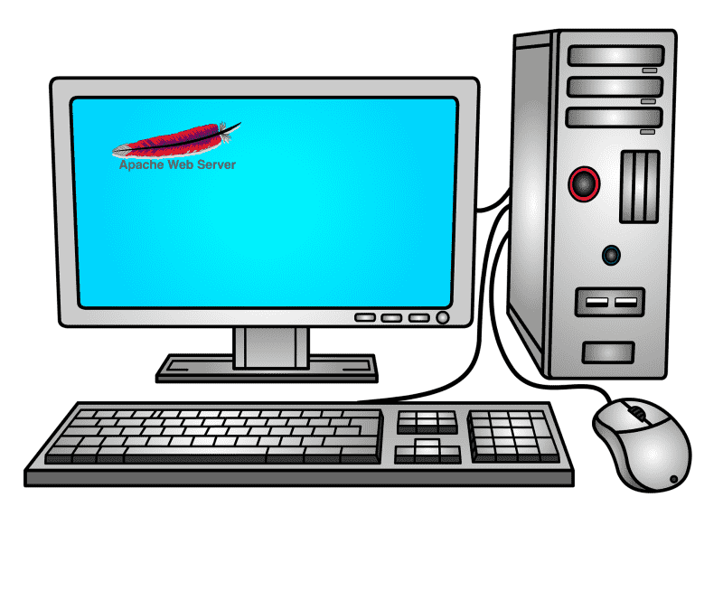

Давайте представим, что вам поручили поднять сайт. Вы берёте один компьютер, ставите на него Linux и поднимаете какое-то приложение, выступающее вебсервером.

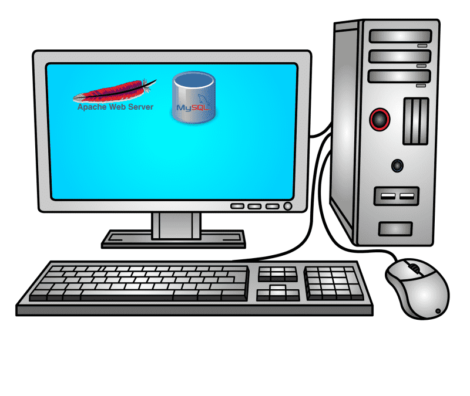

В один из дней этот вебсайт развивают и вам говорят, что для него теперь нужна база данных. И вы на этом компьютере ставите ещё одно приложение. 

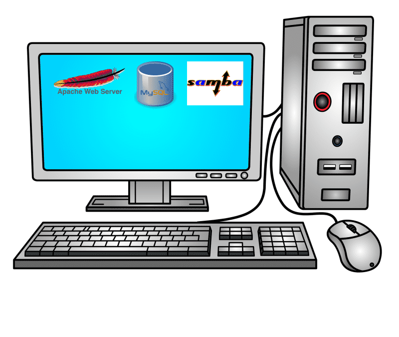

Ещё через пару дней вас просят поднять файловый сервер, чтобы хранить файлы бухгалтерии, данные о клиентах и т.п. И снова вы на этом компьютере поднимаете нужное приложение. 

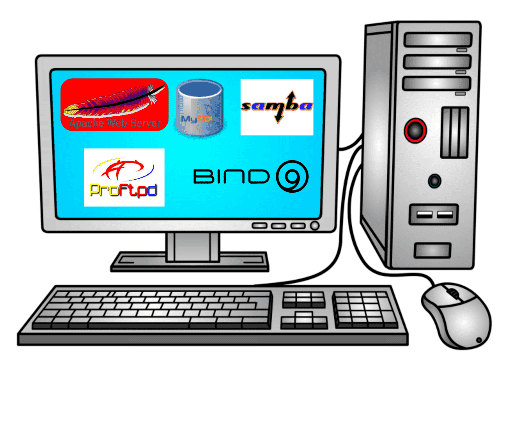

И так продолжается день за днём, вы продолжаете ставить на этот компьютер различный софт. И в один из дней какой-то хакер взламывает ваш вебсервер, получает доступ на сервер и крадёт данные из вашей базы, файлы бухгалтерии и прочую информацию, а напоследок полностью всё стирает.

Вы из этого выносите урок и отделяете вебсервер на другой компьютер. И вроде всё нормально, пока вы на нанимаете младшего специалиста, который по ошибке опять всё стирает. А потом, в один из дней, вы ставите программу, которая при установке ломает кучу зависимостей и опять ничего не работает. 

В итоге вы приходите к пониманию, что лучше все приложения держать отдельно, так легче обеспечить их безопасность и смягчить сопутствующий урон, если что-то пойдёт не так. Но для этого вам придётся купить кучу компьютеров, использовать ресурсов каждый компьютер будет не так много, но вот по деньгам это будет очень дорого.

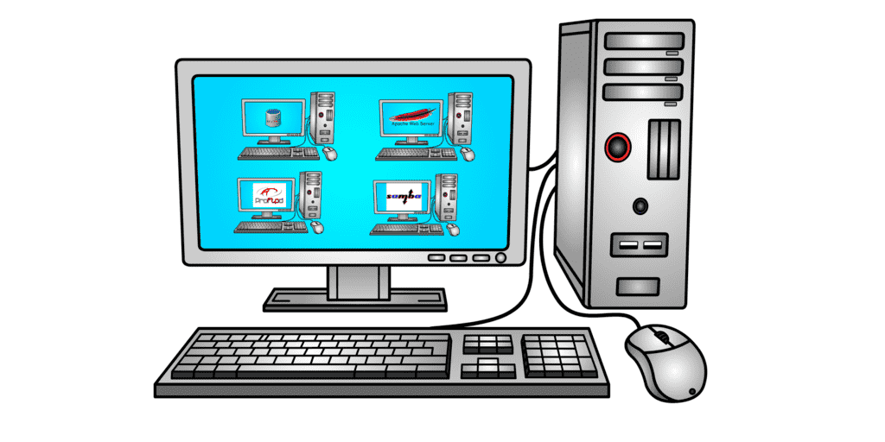

Вы заходите в гугл и узнаёте, что есть такая технология - виртуализация, которая позволяет запускать виртуальные компьютеры внутри реального. И вам теперь не нужно покупать множество компьютеров, всё внутри одного. Но у каждого виртуального компьютера тоже есть виртуальный монитор, виртуальная клавиатура, мышка, виртуальные сетевые адаптеры и кучу прочего оборудования, которые нужно эмулировать. Кроме того, у каждого виртуального компьютера есть своя полноценная операционная система и куча программ и файлов. А значит каждую из этих операционных систем нужно настраивать, обеспечивать безопасность, следить за объёмом диска и т.д. и т.п. Вроде бы все приложения у вас изолированы друг от друга, но вам из-за этого придётся потратиться на довольно дорогой компьютер.

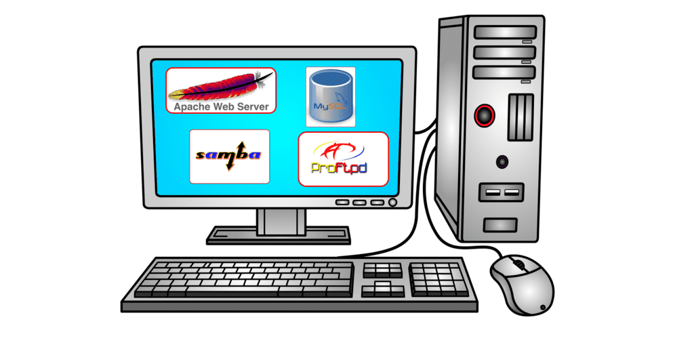

А можно ли как-то изолировать приложения без необходимости поднимать виртуальные компьютеры со всякими устройствами и операционными системами? Да, и это делается через контейнеризацию. Чтобы понять контейнерезиацию, для начала абстрактно представим виртуализацию. 

Представим компьютер - т.е. оборудование. На него ставится операционная система, которую можно поделить на 2 составляющие:

- В пространстве ядра работает ядро операционной системы и его модули. Эта часть отвечает за управление процессами, памятью, драйвера и т.п.
- Другая часть ядра - пространство пользователя. Тут уже работают все наши программы, включая систему инициализации systemd, оболочку, системные и пользовательские приложения.

Для виртуализации ставится специальная программа - гипервизор, к примеру, наш VirtualBox. Он работает и в пространстве ядра в качестве модуля, и в пространстве пользователя в качестве софта для эмуляции оборудования и управления виртуальными машинами. Говоря про эмуляцию оборудования, я в основном говорю про периферию, т.е. процессор и оперативка обычно не эмулируются, а используются напрямую.

Так вот, с помощью гипервизора мы можем создавать виртуальные компьютеры, т.е. виртуальное железо и ставить поверх этого виртуального оборудования полноценную операционную систему, которая также состоит из пространства пользователя и пространства ядра. Вот так работает виртуализация, довольно ресурсоёмко, но зато можно внутри одного компьютера поднять несколько операционных систем.

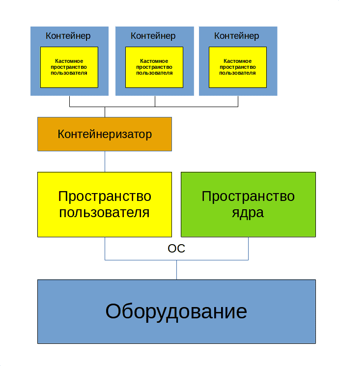

Теперь рассмотрим контейнеризацию. Всё также мы поверх оборудования ставим операционную систему, но теперь вместо гипервизора используем другой софт - контейнеризатор. Если при виртуализации нам нужно было виртуальное железо, чтобы на нём запустить полноценную операционную систему, то в контейнерах нет полноценной операционной системы. Пространство ядра общее для всех контейнеров и основной операционной системы, отличается только пространство пользователя.

При этом, если я хочу запустить вебсервер в контейнере, нужны ли мне systemd и куча другого софта, которые используются в полноценной системе? Да нет, хватит каких-то основных библиотек, какого-то базового софта и всё, а вебсервер можно хоть скриптом запускать. В другом контейнере, где будет крутиться другой софт, будут только те файлы, которые нужны для работы того софта. Т.е. получается мы изолировали программу и обеспечили её зависимостями, это и есть наш контейнер. 

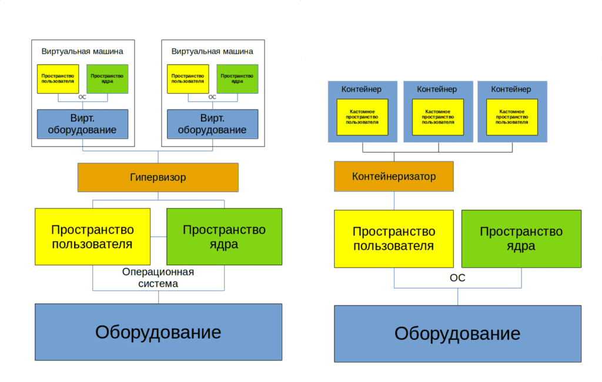

И какие выводы можно из этого сделать?

Виртуализация эмулирует железо и ставит полноценную операционную систему, где изначально куча софта, а значит используется много ресурсов. При этом нужно следить за каждой виртуалкой, обеспечивая её безопасность всякими антивирусами, файрволами и прочим, а также следить за использованием диска и прочих ресурсов. Зато здесь можно поставить любую операционную систему и делать почти всё что угодно.

Контейнеризация, грубо говоря, просто изолирует процессы. Работает программа в своём пространстве и видит только то что ей нужно. При этом контейнеры используют общий kernel space. Т.е. если программа создана под линукс, то в своём контейнере она будет работать на любом дистрибутиве. А вот если программа создана под Windows, то контейнер с ней будет работать только на Windows.

Поэтому современная инфраструктрура это смесь виртуализации и контейнеризации. Причём, нередко система с контейнерами крутится внутри виртуалки.

Если говорить про контейнеризацию, то идея изолировать процессы и директории, в которых они работают, существует давно. Ещё во времена UNIX-а появился chroot, который запирал процессы в директории и они думали, что корнем является эта директория. Есть cgroups, с помощью которого можно ограничивать процессам ресурсы, также есть namespaces для изоляции процессов, сетевых устройств и прочих ресурсов операционной системы. Можете прочитать чуть подробнее в [статье](https://habr.com/ru/company/selectel/blog/279281/) на хабре. 

Но был нюанс - зачастую, чтобы настроить изоляцию, приходилось прочесть много документации и много повозиться. Это отпугивало многих и они предпочитали не заморачиваться с изоляцией. Поэтому нужен был простой и удобный инструмент для изоляции. 

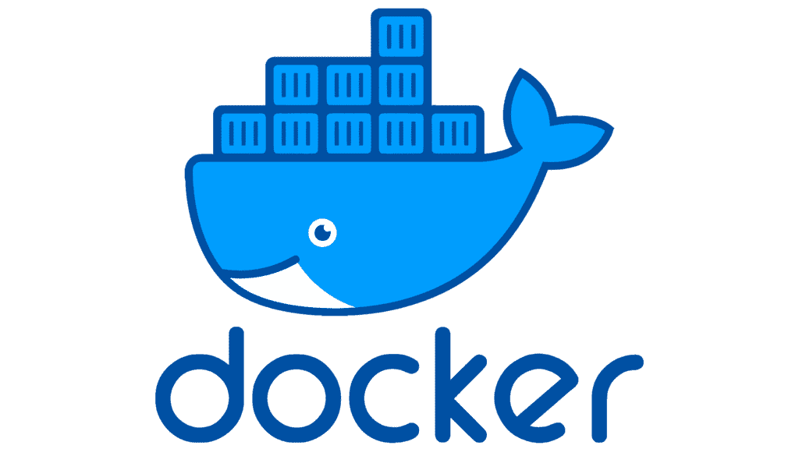

И им стал Docker. Как для виртуализации одной из программ является VirtualBox, так и для контейнеризации одной из программ является Docker. Разве что Docker является самым популярным решением. Во-первых, потому что он предоставляет удобный функционал для работы с контейнерами. 

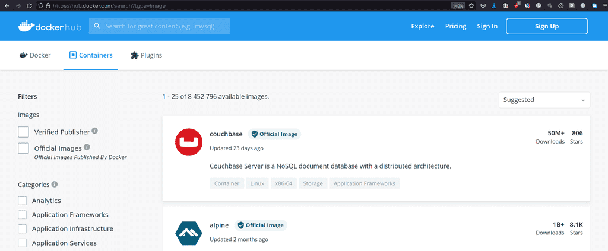

Во-вторых, потому что [dockerhub](https://hub.docker.com/search?type=image). Помните, мы говорили про кастомные пространства пользователей в контейнерах? С другими типами изоляции вам приходилось их вручную собирать, а докер позволяет скачать готовые образы одной командой. Захотели вебсервер? Хватит одной команды и ничего не нужно настраивать, плюс к тому же это изолировано. Хотите связку из вебсервера, прокси сервера и ещё кучи каких-то других приложений? Берёте небольшой файлик с парочкой опций и всё готово. Вручную вы бы это настроили за пару дней, мучаясь с документацией и непонятными проблемами, а тут буквально пару минут и всё работает. А если что-то упадёт или даже всё? Восстановить какой-то сервис или полностью инфраструктуру на виртуалках может занять дни, недели, а то и месяцы. А если всё на контейнерах, то почти всё можно поднять автоматом за пару часов. 

Конечно, звучит здорово, но с контейнерами нужно работать несколько иначе, чем с виртуалками, т.е. нужны другие методологии и практики. Например, контейнеры рассчитаны на то, что данные там не будут храниться и что в любой момент вы можете удалить контейнер и заново поднять. Т.е. в контейнере крутится только софт, и если с ним что-то случится - баг, или взлом, или любая другая проблема - вы просто удаляете этот контейнер и поднимаете новый, ни о чём не задумываясь. С виртуалкой так делать нельзя, потому что внутри виртуалки данные - придётся сначала их забрать оттуда. А к контейнерам вы изначально цепляете данные отдельно, как, скажем, к виртуалке цепляете отдельный диск только для данных. Такой подход называется stateless - т.е. без сохранения состояния. Упал контейнер - и фиг с ним, подцепил данные к другому и запустил. Потому что иначе вас ждут проблемы - в этом кастомном пространстве пользователя почти нет всяких утилит, которые бы помогли вам восстановить работу. Вплоть до того, что в контейнере может не быть текстового редактора, баша и прочих прелестей обычных систем.

Но вы можете создать свой образ и положить туда нужные вам инструменты, либо изменить существующий образ. Давайте определимся с некоторыми терминами. 

- Image - образ системы, т.е. шаблон. Грубо говоря, это кастомный userspace с какими-то готовыми программами, библиотеками и прочим. 
- Dockerfile - вы можете написать текстовой файл, в котором указываете инструкцию по сборке. И запустив команду с эти файлом, вы получите образ - image. Опять же, это не обязательно и вы можете использовать готовые образы. 
- Контейнер - запущенный образ. С одного образа вы можете хоть 100 контейнеров запустить. При этом каждый контейнер будет по своему уникален. Как в поговорке - "Нельзя дважды войти в одну и ту же реку". Если вы запустили образ - то там уже запустились процессы, написались логи, какие-то события произошли. Т.е. что-то поменялось и уже это нельзя назвать образом или шаблоном. Но, если вы захотите, сможете из контейнера сделать образ.
- Registry - репозиторий - место, где держат образы. Как тот же самый докерхаб. Но вы можете поднять внутри компании свой репозиторий для своих кастомных образов.
- Persistent storage - постоянное хранилище - то что цепляется к контейнеру для постоянного хранения данных. Если вы удалите контейнер, эти данные останутся и вы сможете прицепить хранилище к другим контейнерам. 

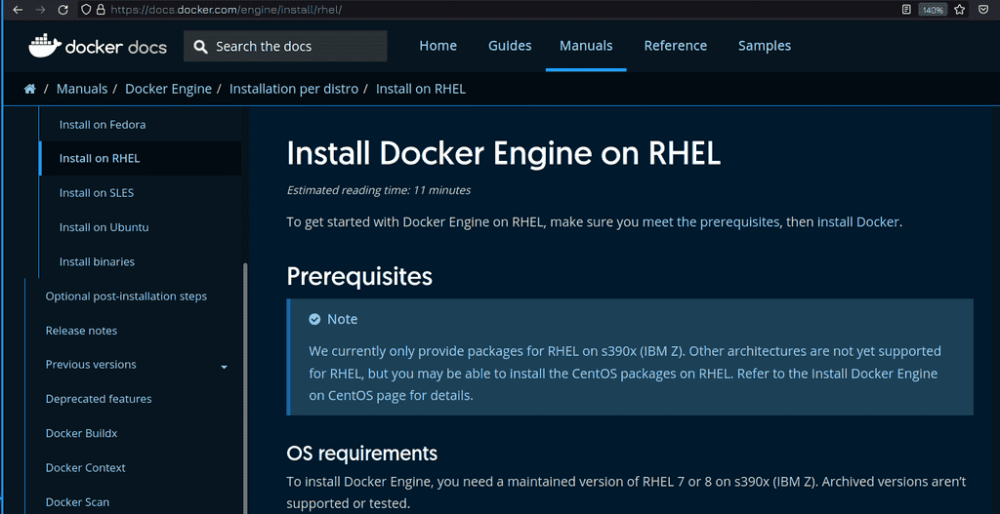

Касательно установки докера, всегда рекомендую предварительно смотреть документацию на официальном [сайте](https://docs.docker.com/). Обычно всё сводится к добавлению официального репозитория и установке пакетов из него. При этом ставится бесплатная версия докера. Как вы поняли, есть и платная, коммерчески поддерживаемая версия. Но на RHEL docker не поставить, хотя на Centos можно.

Для своего дистрибутива Red Hat заменили docker на podman, работать с которым мы научимся в следующем уроке. Podman, как и docker, сделан по определённым стандартам, поэтому контейнеры, которые работают в докере, будут работать и в подмане. Даже большинство команд докера будут работать в подмане. Есть архитектурные и функциональные отличия, которые мы затронем в следующем уроке.

Вообще, тема контейнеризации и, в частности, докера, слишком обширная, чтобы рассмотреть в рамках одного, двух или даже десяти уроков. Поэтому в данном курсе я рассмотрю то что касается экзамена, а если вам интересно, в интернете есть множество бесплатных курсов по докеру. Но к теме докера я и сам вернусь в будущих курсах.