# 63. Работа с podman

<iframe width='560' height='315' src="https://www.youtube.com/embed/RqqKF0ubtYE" title='YouTube video player' frameborder='0' allow='accelerometer; autoplay; clipboard-write; encrypted-media; gyroscope; picture-in-picture' allowfullscreen></iframe>

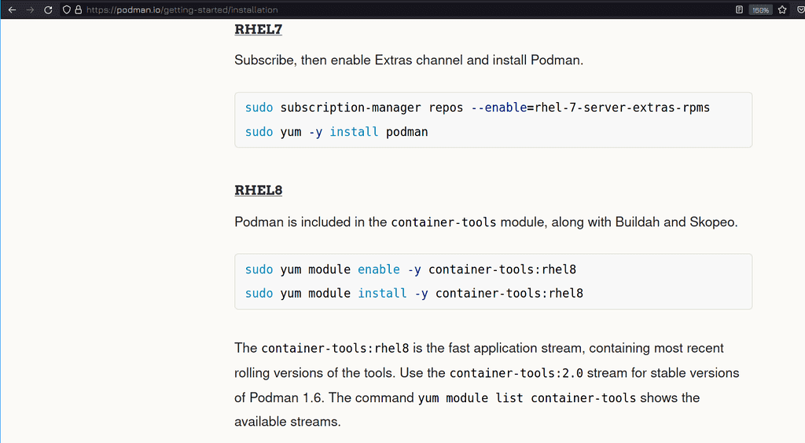

От теории к практике. Давайте установим podman. Мы бы могли в репозиториях поискать нужный пакет, но так стоит делать только с простыми утилитами. Если дело касается чуть более сложных программ, всегда стоит проверять документацию на официальном сайте этой программы. Поэтому идём на сайт [podman.io](https://podman.io/getting-started/installation) и находим инструкцию по установке на наш RHEL. Как видите, здесь указано, что нужно включить модуль container-tools и установить его. Напомню, что модули - это группы пакетов, нацеленных на решение одной задачи. Как и в нашем случае - для работы с контейнерами нужны несколько различных иструментов.  

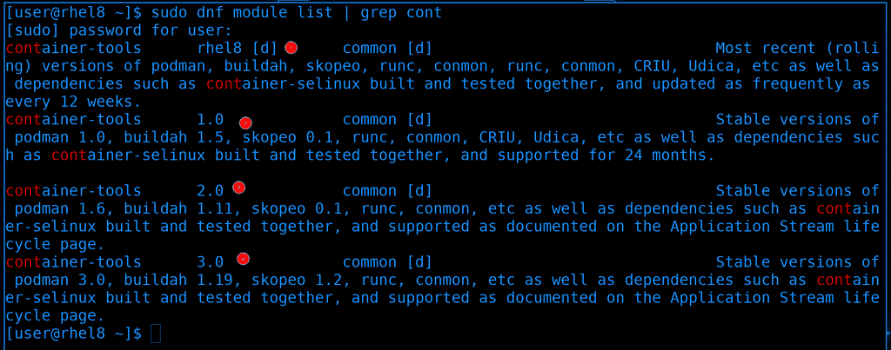

Давайте найдём этот модуль через dnf:

```
sudo dnf module list | grep cont
```

Можно увидеть 4 версии этого модуля, в которых отличаются версии пакетов, где-то podman версии 1.0, где-то 1.6, а где-то 3, ну и также для других связанных инструментов. Документация на сайте советовала нам ставить первый модуль, который обновляется каждые двенадцать недель. 

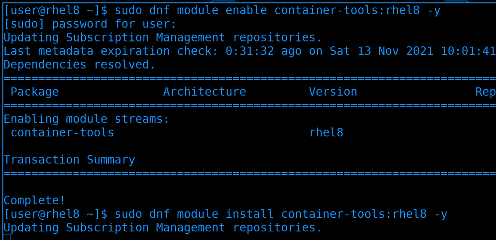

В некоторых случаях бывает нужно использовать старую версию, если, допустим, что-то в новой у нас не работает, но для обучения нам сойдёт и последняя версия. Включим модуль с ней и установим его:

```
sudo dnf module install container-tools:rhel8 -y
```

Кстати, вместе с подманом и другими утилитами ставится и модуль для cockpit, т.е. контейнерами можно будет управлять и через веб интерфейс.

Касательно отличий докера и подмана, их не так много, но кое-что есть.

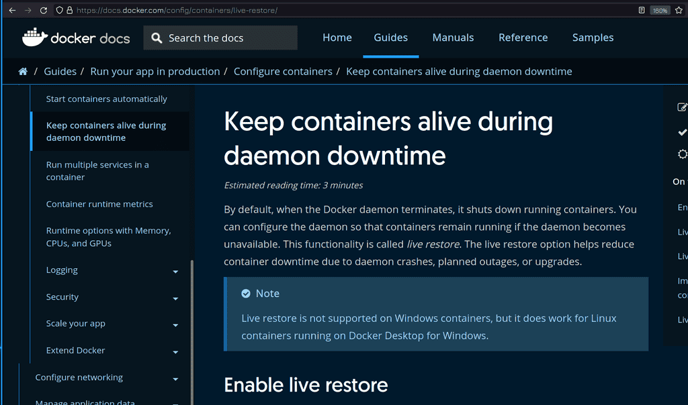

- Во-первых, для работы докера нужен демон. Где-то это называют единой точкой отказа, т.е. если с демоном что-то случится, он выключит контейнеры. Можно настроить, чтобы контейнеры работали даже если докер демон перестанет работать, но в любом случае управлять ими нормально не получится и в целом может привести к проблемам. А вот podman работает без демона, поэтому такой проблемы можно избежать. Не то, чтобы это решающий фактор отказаться от докера, скорее небольшой плюсик в сторону подмана.


- Во-вторых, podman умеет работать с подами. Собственно, поэтому он так и назван - pod manager. Что такое поды? Хотя мы и говорим, что контейнеризация нужна для изоляции приложений, иногда они должны общаться. Скажем, вебсервера очень часто должны работать с базой данных, а она работает в другом контейнере. Также нередко для вебсерверов ставят прокси сервера. И хотя получается 3 разных приложения, служат они для одной задачи. Когда у вас приложений много, становится сложно управлять всеми контейнерами по отдельности, и появляется понятие под - эдакая группа контейнеров. Поды позволяют связать контейнеры и управлять ими как единым целым. В чистом виде докер не используется в больших инфраструктурах, обычно там работает кубернетс или подобный софт, который вносит понятие подов и централизовано управляет всем. Но кубернетс большой и сложный продукт, который нужно изучать и не так легко администрировать, как докер, поэтому не всегда подходит для мелких и средних компаний. А podman такой же простой, как и докер, при этом ещё и поды поддерживает.

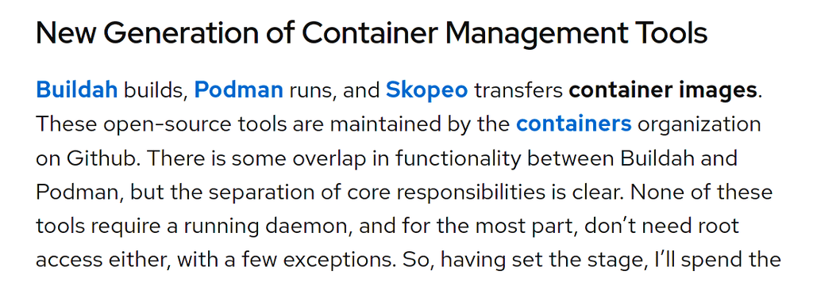

- В-третьих, docker - один инструмент с кучей функционала. Разработчики podman-а, в свою очередь, пытались соответствовать философии UNIX -     пишите программы, которые делают что-то одно и делают это хорошо. Поэтому функционал докера в подмане разнесён по разным инструментам: для сборки образа используется утилита buildah, а для работы с репозиториями и образами в них - skopeo, сам же podman в основном отвечает за управление контейнерами.


Хотя практически везде пишут, что podman работает без рут прав, в отличии от докера, но и докер тоже можно настроить, чтобы он работал не от рута. Правда некоторые путают это с добавлением пользователя в группу docker, но это разные вещи. Если добавить пользователя в группу докер, он может управлять контейнерами без sudo прав, но сами контейнеры всё равно будут работать от рута. А для настройки работы докер демона без рут прав нужно кое-что перенастраивать. Информацию об этом можете посмотреть по [ссылке](https://docs.docker.com/engine/security/rootless/). Но, справедливости ради, докер надо перенастраивать, а podman так работает из коробки.

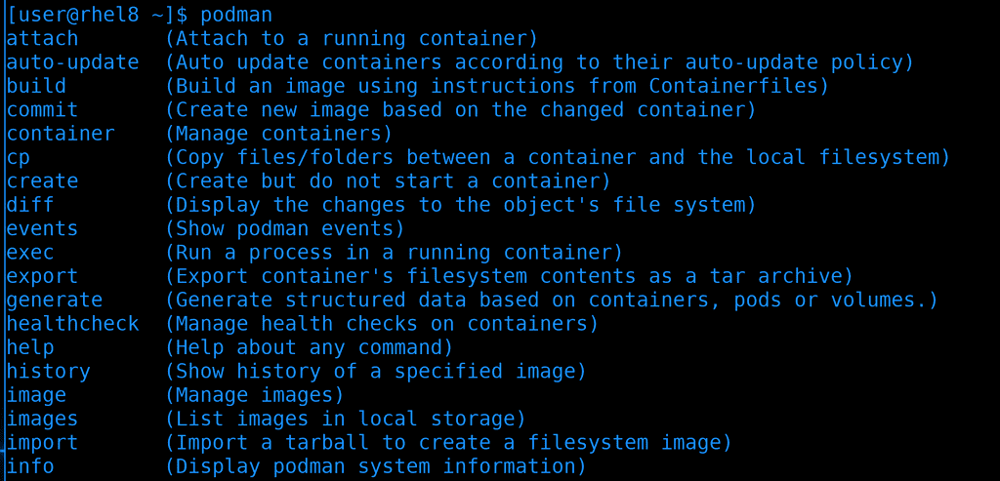

Ладно, давайте теперь займёмся делом. У команды podman множество ключей, если написать podman и два раза нажать tab, можно увидеть список команд и описание к ним:

```
podman
```

Работа с контейнерами напоминает что-то среднее между управлением пакетами с помощью dnf и управления виртуалками. 


Например, можно искать контейнеры с помощью опции search:

```
podman search ssh
```

При этом, как видите, используются различные репозитории и ссылки на образы.

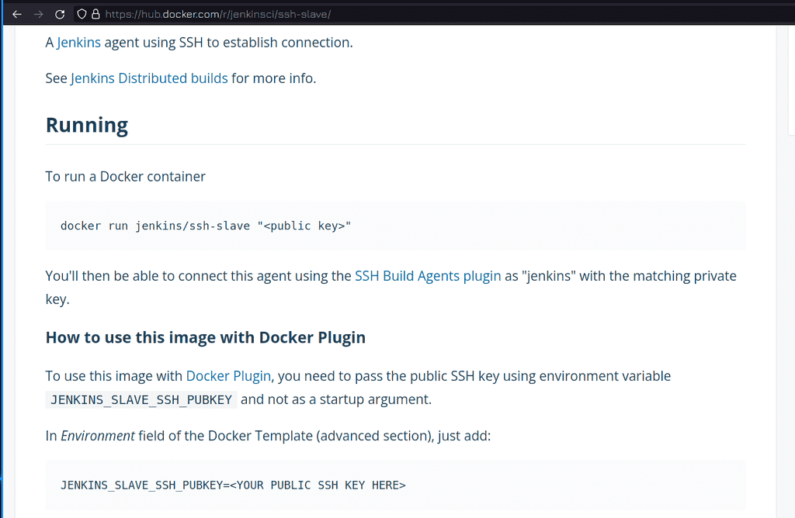

По названию образа в интернете можно найти полезную информацию к нему, например, какие переменные можно передавать образу, с какими ключами стоит использовать и т.п.


Информация о репозиториях и ссылки на них указаны в файле registries.conf в директории /etc/containers/:

```
grep registries /etc/containers/registries.conf
```

Видите, указано unqualified? Это означает, что если вы просто попытаетесь скачать образ не указав полную ссылку к нему, то образ будет искаться в одном из этих репозиториев. Но это плохая практика, а вдруг кто-то изменит этот список и укажет на свой репозиторий? Образы лучше скачивать указывая полный путь к ним.  


В локальных сетях может понадобится локальный репозиторий. И его можно поднять на том же контейнере. Давайте для начала найдём нужный образ с помощью search:

```
podman search registry
```

В списке вышло довольно много образов, но по полю STARS можно определить, 
что самый популярный - docker.io/library/registry. Рядом с ним под Official прописано OK, т.е. образ официальный. И ссылка ведёт на официальный сайт докера, т.е. это то что нам нужно.

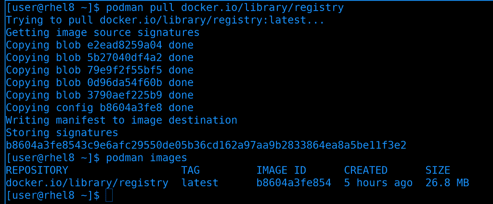

Чтобы скачать образ используем опцию pull и укажем полную ссылку к образу:

```
podman pull docker.io/library/registry
```

После того, как образ скачается, можно посмотреть список образов с помощью опции images:

```
podman images
```

Чтобы запускать контейнеры свой репозиторий не нужен, мы его делаем только для того, чтобы создавать свои образы и раздавать их на другие наши сервера. Ну и чтобы экономить трафик - один сервер будет скачивать с интернета в локальный репозиторий, а другие сервера будут брать с этого локального репозитория.


Теперь попробуем поднять свой репозиторий. Для начала ему нужен persistent storage, чтобы в случае проблем с контейнером мы не потеряли образы. Для этого создаём директорию:

```
mkdir registry
```

Дальше нужно запустить контейнер. Для этого используется опция run:

```
podman run --name myregistry -p 5000:5000 -v /home/user/registry:/var/lib/registry -d registry
```

Можно конечно запускать просто:

```
podman run registry
```

но получится просто изолированный контейнер, толку от которого мало. Поэтому давайте разберём наши ключи:

- --name - имя контейнера. Можно его не задавать, тогда podman сам сгенерирует для него имя.
- -p - проброс портов. В левой части порты на нашем хосте, справа - порты в контейнере. Т.е. мы говорим, что нужно открыть на локальноый системе порт 5000 и пробросить его на 5000 порт контейнера. А в контейнере программа по умолчанию работает на 5000 порту. Но это касается именно registry, это его дефолтный порт. Скажем, если бы это был вебсервер, то мы бы указывали справа порт 80, так как в контейнере приложение слушало бы на 80 порту. Узнать, какой порт слушает по умолчанию образ можно на страничке самого образа в интернете. Так вот, мы пробросили порты, чтобы могли подключаться к репозиторию по сети.
- -v - volume. Какую директорию хоста к какой директории контейнера цеплять. Опять же, слева директория на нашей системе, справа - внутри контейнера. Т.е. наша директория /home/user/registry будет монтироваться в /var/lib/registry этого контейнера. Если мы удалим контейнер, эта директория никуда не денется и мы сможем прицепить её к другому контейнеру. И да, какую именно директорию внутри контейнера надо выносить обычно пишется на страничке образа или в документации, куда обычно дают ссылку. А опция :Z в конце нужна, чтобы selinux не блокировал попытки контейнера что-то изменить в проброшенной директории.
- -d - detach - отсоединить. Т.е. запустить контейнер в фоновом режиме. Если этот ключ не использовать, контейнер запустится в интерактивном режиме, а чтобы отсоединиться придётся вводить комбинацию клавиш. Легче сразу указать этот ключ при запуске. 
- registry - название образа. Обратите внимание, что его нужно указывать в конце, после всех ключей. На самом деле после образа тоже можно указывать опции, но они уже будут относиться к самому контейнеру, а не подману.


Список запущенных контейнеров можно увидеть с помощью опции ps:

```
podman ps
```

При этом можно увидеть проброшенные порты, название, команду, запущенную в контейнере, время создания и текущий статус контейнера. А с помощью опции logs можно сразу просмотреть логи контейнера:

```
podman logs myregistry
```

Обычно туда сыпятся логи самого приложения внутри контейнера, засчёт чего не нужно заходить внутрь контейнера и возиться с поиском логов.

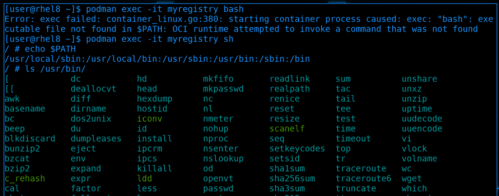

Как я говорил, обычно в контейнере минимум программ, поэтому решать проблемы изнутри довольно сложно. Но такая необходимость иногда появляется, поэтому вы можете подключиться к контейнеру используя опцию exec:

```
podman exec -it myregistry bash
podman exec -it myregistry sh
```

Как видите, bash-а в контейнере нет, зато есть shell. Здесь ключ -i означает интерактивно, а ключ -t - что нужно выделить для этого виртуальную консоль. Если же посмотреть директории с переменной PATH, можно заметить, что утилит здесь довольно мало:

```
ls /usr/bin/
```

Но в некоторых образах программ много и можно управлять контейнером почти как виртуалкой. 


А если в контейнере есть systemd, а у вас настроен Selinux, для нормальной работы контейнера следует кое-что разрешить в Selinux на хосте:

```
sudo setsebool -P container_manage_cgroup 1
```

Чтобы выйти из контейнера просто нажимаем Ctrl+D.


Если нам нужно запустить какую-то команду в контейнере, не заходя в него, достаточно ключа -d. Например, создадим в проброшенной директории файл и убедимся, что он появился в нашей домашней директории:

```
podman exec -d myregistry touch /var/lib/registry/file
ls registry/
rm registry/file
```


Теперь давайте закинем в наш локальный репозиторий какой-нибудь образ, к примеру, образ самого registry. Прежде чем это сделать, ещё раз вглянем на список наших образов:

```
podman images
```

Как видите, у образа указан репозиторий docker.io. Нам нужно поменять этот репозиторий, для этого используем опцию tag:

```
podman tag docker.io/library/registry:latest rhel8:5000/registry
podman images
```

После опции tag мы указываем старый репозиторий, а потом новый. Теперь в списке образов мы видим новый образ с локальным репозиторием. Но при попытке залить образ в репозиторий c помощью опции push:

```
podman push rhel8:5000/registry:latest
```

мы получим ошибку, мол, мы пытаемся залить с помощью https, а сервер поддерживает только http. Можно было бы заморочиться с сертификатом, но мы сделаем несколько иначе - разрешим нашей системе работать с локальным репозиторием без сертификата. 


Для этого мы должны в файле /etc/containers/registries.conf прописать наш репозиторий. Пример, что именно нужно писать, есть в самом файле:

```
sudo nano /etc/containers/registries.conf
```

```
[[registry]]
location = 'rhel8:5000'
insecure = true
```

В location мы указываем на локальный адрес и порт, а insecure нам нужен, чтобы разрешить подключение через http.

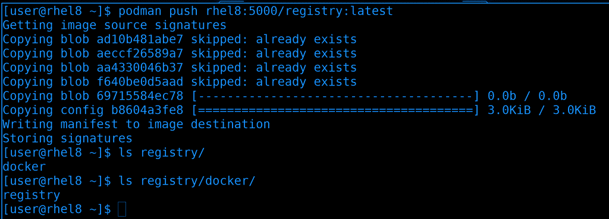

После изменения настроек ещё раз запустим push:

```
podman push rhel8:5000/registry:latest
ls registry
ls registry/docker
```

На этот раз всё прошло без проблем и даже в директории registry мы теперь можем увидеть наш контейнер.


Теперь мы можем удалить наш старый образ и оставить только локальный, для этого нужно использовать опцию image с ключом rm:

```
podman images
podman image rm docker.io/library/registry:latest
podman images
```


Но, как вы заметили, чтобы залить публичный образ в локальный репозиторий, надо его скачать с помощью pull, потом поменять тег, а потом залить с помощью push. Вместо этого можно использовать утилиту skopeo. К примеру, найдём ссылку на httpd:

```
podman search httpd | head -3
```

После чего используем утилиту skopeo с опцией copу, указывая откуда и куда:

```
skopeo copy docker://registry.fedoraproject.org/f29/httpd docker://rhel8:5000/httpd
```

Обратите внимание, что перед ссылками я добавил docker://. Это нужно, потому что копирование происходит по определённому механизму. Механизмы могут быть разные, где-то с авторизацией, где-то без, но в большинстве случаев docker:// хватает.

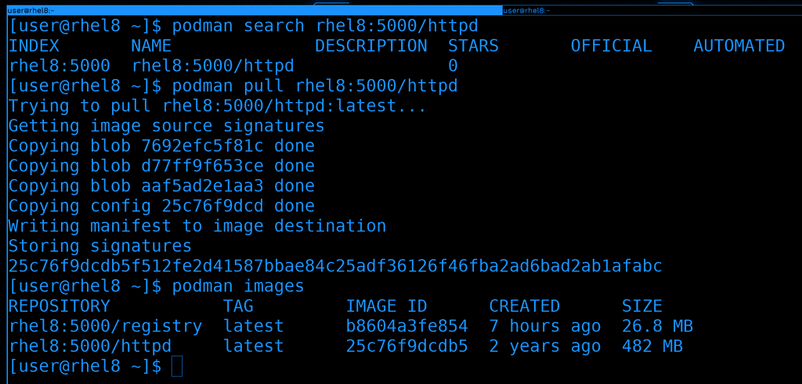

Кстати, давайте убедимся, что образ есть в локальном репозитории и что его можно поставить. Найдём его с помощью search:

```
podman search rhel8:5000/httpd
```

И скачаем с помощью pull:

```
podman pull rhel8:5000/httpd
podman images
```

Как видите, теперь у меня два образа, оба указывают на локальный репозиторий.


Если у вас нет доступа к документации образа, но вам нужно разобраться, что там крутится, какие порты используются и увидеть все подробности про образ, вы можете использовать опцию image inspect. Например, посмотрим, что у нас в образе httpd:

```
podman image inspect rhel8:5000/httpd:latest
```

Здесь видно, какой пользователь в контейнере, какие порты, какие переменные окружения прописаны и прочая необходимая информация.

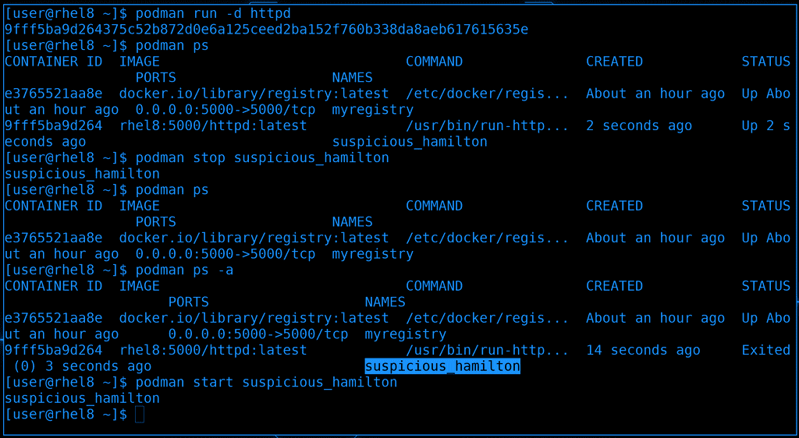

Давайте пройдёмся по частоиспользуемым ключам. И так, мы разбирали, что run позволяет создать контейнер и сразу же запустить:

```
podman run -d httpd
```

После чего его можно увидеть с помощью опции ps:

```
podman ps
```

Как видите, контейнер получил рандомное, но читаемое название. Контейнер можно остановить с помощью stop:

```
podman stop suspicious_hamilton
```

Обратите внимание, что нужно использовать именно название контейнера, а не образа. После остановки мы перестанем видеть контейнер с помощью ps:

```
podman ps
```

Чтобы увидеть и выключенные контейнеры, нужен ключ -a:

```
podman ps -a
```

Ну и соответственно для запуска контейнера нужен ключ start:

```
podman start suspicious_hamilton
```

Опять же, указываем имя контейнера, а не образа. После остановки контейнера можно использовать опцию rm для его удаления.


В некоторых репозиториях настроена аутентификация. Например, хотя докерхабом могут пользоваться все желающие, чтобы не забивать трафик на сервера там настроен лимит на скачивание образов с одного IP адреса. Хотя лимит довольно большой, но если не пользоваться локальными репозиториями, если много тестировать, можно дойти до лимита. И чтобы платные подписчики не страдали из-за лимита, в докерхаб можно логиниться с опцией login:

```
podman login docker.io
```

Это касается не только докерхаба. Даже в локальных репозиториях иногда стоит настраивать аутентификацию, чтобы не каждый желающий мог скачивать образы.  

Хоть сейчас наши контейнеры и работают, но после перезагрузки автоматом не будут стартовать. Обычно за автозапуск приложений отвечает systemd, но podman работает без демона, поэтому после перезагрузки не будут стартовать контейнеры сами по себе. Для этого нам нужно самим создать systemd сервисы. Но есть нюанс - если мы создадим сервисы как мы это делали раньше, то они будут запускаться от рута, чего нам не хотелось бы. Да, конечно мы можем в сервисе указать юзера, но есть уже готовое решение. Точнее, полуготовое. 


Но благо есть документация. То что мы ищем относится к опции generate systemd:

```
man podman-systemd-generate
```

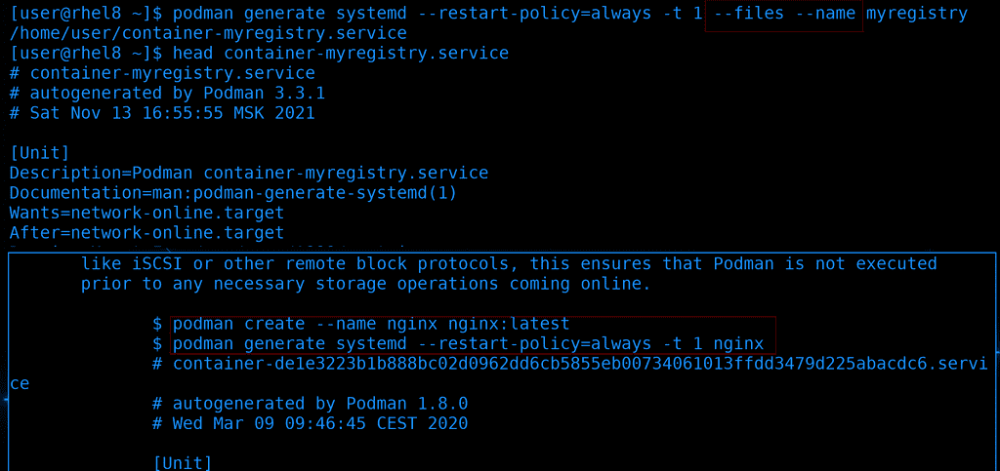

В примерах есть две команды: podman create и podman generate. Create относится к созданию контейнера, он у нас уже есть, поэтому эту команду пропускаем. Дальше generate - эта команда создаёт файл systemd сервиса. Используем её указав наш контейнер:

```
podman generate systemd --restart-policy=always -t 1 --files --name myregistry
```

К этой команде я добавил ещё два ключа - --files и --name. Оба ключа есть в той же документации, только чуть ниже, в примерах с подами. Они позволяют сразу создать файл, а не выводить файл сервиса на экран. В итоге в нашей домашней директории появится файл systemd сервиса.  

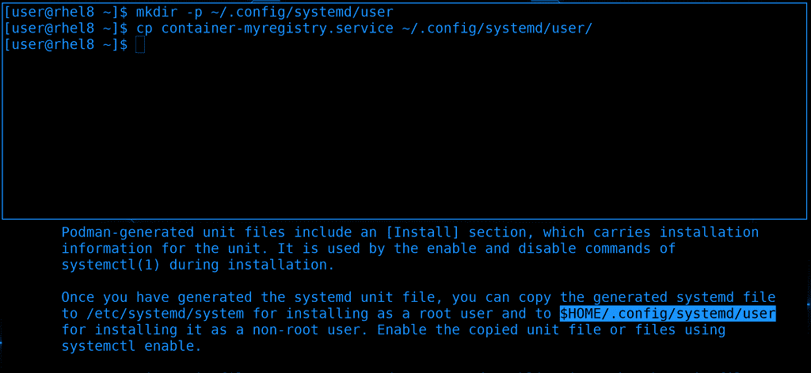

Для начала, у systemd есть глобальные сервис, а есть и личные сервисы каждого пользователя. Глобальные лежат в /etc/systemd, а личные - в домашней директории пользователя в директории ~/.config/systemd/user. Чуть ниже в мане можно найти эту директорию, если вдруг забыли, где она находится. По умолчанию, такой директории нет, поэтому стоит её создать и скопировать туда сгенерированный файл:

```
mkdir -p ~/.config/systemd/user
cp container-myregistry.service ~/.config/systemd/user/
```

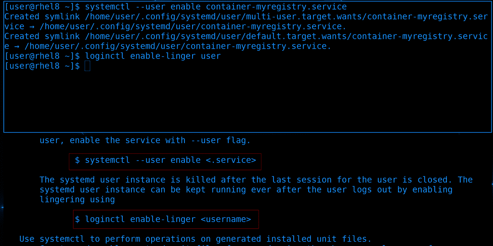

После чего нам надо включить этот сервис. Если сервис принадлежит пользователю, то ему не нужно писать sudo, но нужно добавлять ключ --user:

```
systemctl --user enable container-myregistry.service
```

Опять же, в документации пониже есть пример этой команды. Ну и самое главное - пока у пользователя нет сессий, его systemd не будет работать. Значит после перезагрузки контейнеры не запустятся, а если человек разлогиниться - завершатся. Чтобы позволить сервисам пользователя работать без его логина, надо включить опцию lingering, которая также показана в документации:

```
loginctl enable-linger user
```

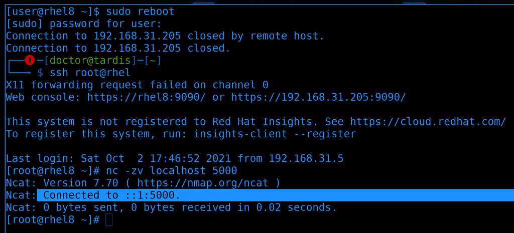

И чтобы убедиться в том, что наш контейнер запустится после рестарта и будет работать без нашего участия, давайте перезагрузим систему:

```
sudo reboot
```

После чего сразу подключимся пользователем root, чтобы не вызвать старт сессии пользователя user и просто проверим доступность порта:

```
ssh root@rhel
nc -zv localhost 5000
```

Как видите, порт доступен, а значит контейнер запущен.


Ну и podman ps от рута ничего нам не будет показывать:

```
podman ps
```

потому что у каждого пользователя свои контейнеры. Поэтому перейдём на нашего пользователя и проверим статус контейнеров:

```
su - user
podman ps
```

Ну и отсюда тоже видно, что контейнер запустился не секунду назад, а уже работает со времени запуска системы.

Ну и стоит учитывать, что из-за того, что наш контейнер работает не от рута, ему запрещено пробрасыватьпорты ниже 1024. Т.е. внутри контейнера может быть любой порт, а вот снаружи только выше 1024. Порты ниже 1024 называются привелигированными и считается, что сервис, стоящий за ними, работает от рута, а те что выше - непривилегированными, а значит любой желающий сервис может их использовать.


Как же нам тогда использовать порты ниже 1024? Можно, к примеру, делать перенаправление на файрволе. Если нам обязательно, чтобы клиенты подключались к порту 80, то можем прописать такое правило:

```
sudo firewall-cmd --add-forward-port=port=80:proto=tcp:toport=5000 --permanent
sudo firewall-cmd --reload
```

Здесь сказано, что нужно перенаправлять пакеты, приходящие на 80 порт по tcp на порт 5000. Ну и для теста с моей системы запустим проверку доступности порта:

```
nc -zv 192.168.31.205 80
```

Всё работает как надо.


Ну и напоследок, давайте глянем cockpit. Здесь у нас появилась вкладка podman containers. Нас предупреждают, что podman не настроен как сервис и простым нажатием "Start podman" это можно сделать.

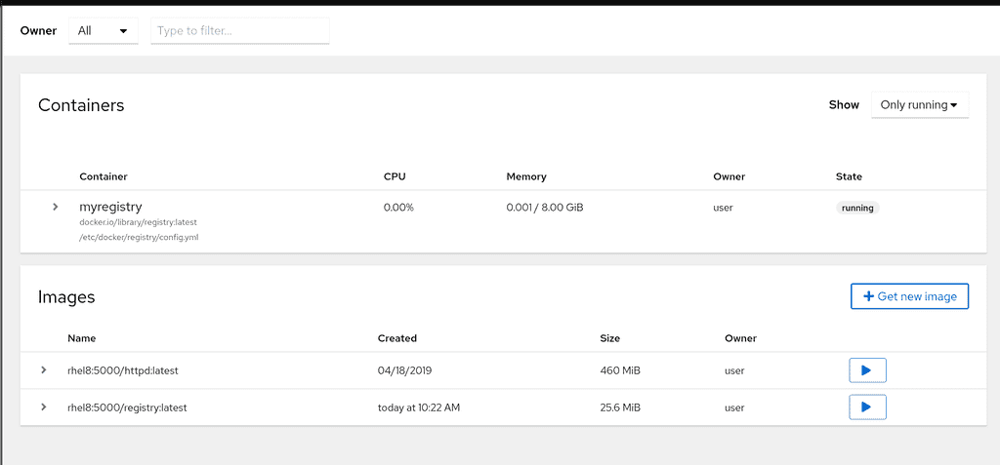

После чего мы увидим окно с нашими контейнерами и образами. 

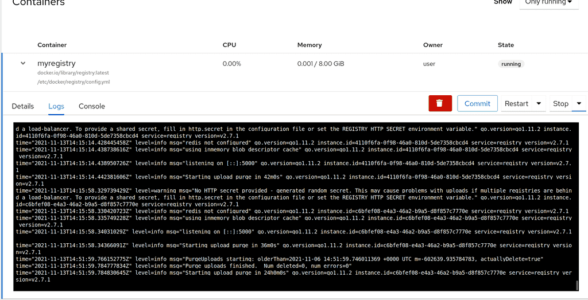

Отсюда мы можем управлять контейнерами, смотреть логи и даже подключаться к консоли контейнера.

Давайте подведём итоги. Сегодня мы разобрали, как работать с подманом - как искать и скачивать образы, поднимать контейнеры, управлять ими, добавлять их в автозапуск. Кроме того мы подняли свой репозиторий для контейнеров и научились бросать туда образы. Как я говорил, тема контейнеризации довольно большая и нам всего не разобрать, но мы на базовом уровне научились работать с контейнерами, а это уже покрывает большую часть задач.